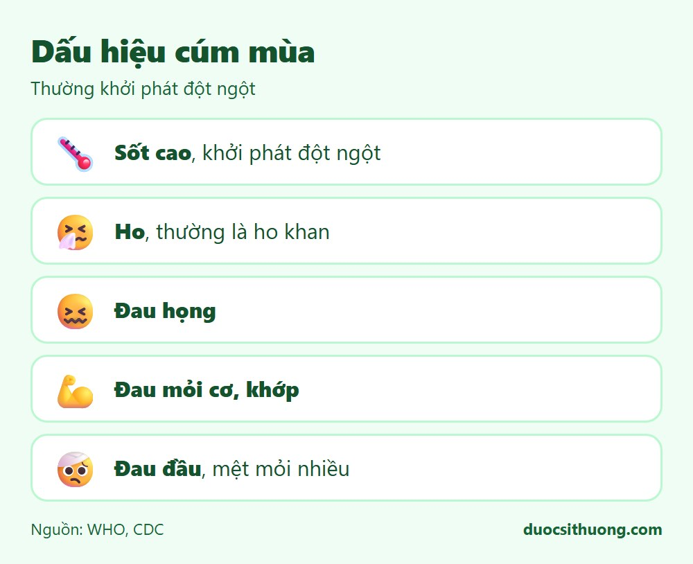
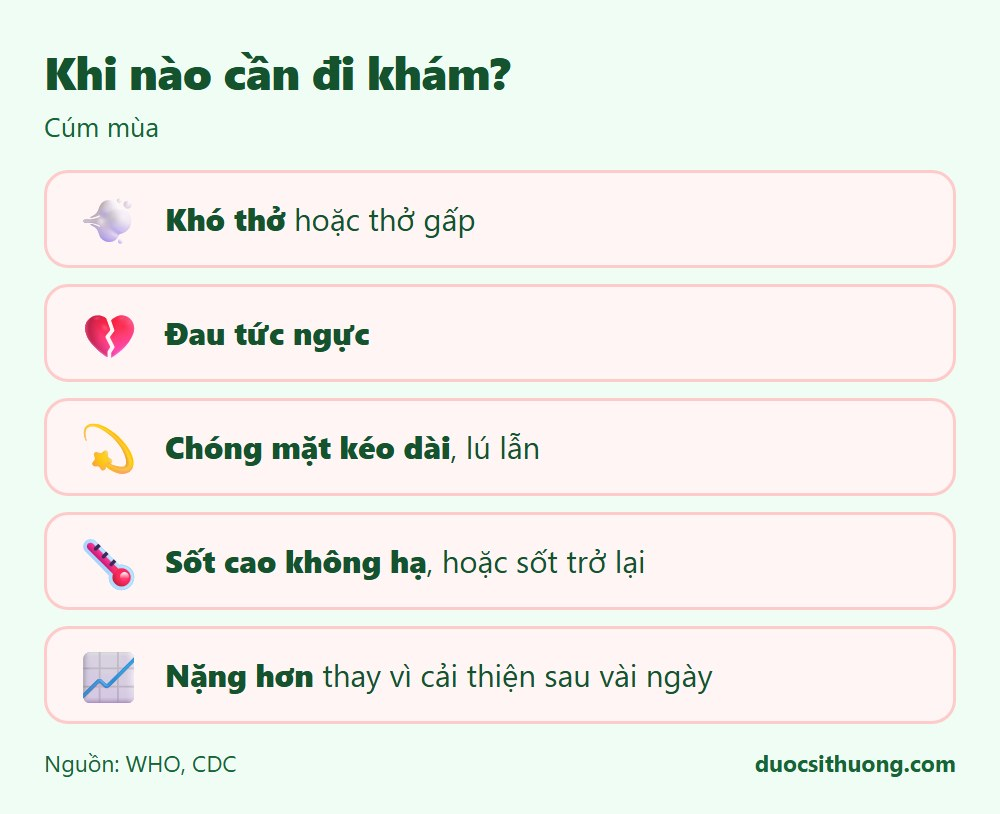

## Tóm tắt nhanh

Cúm mùa là bệnh nhiễm virus đường hô hấp, thường khởi phát **đột ngột** với sốt cao và đau mỏi người, khác với cảm lạnh thường diễn tiến từ từ và nhẹ hơn. Phần lớn người khỏe mạnh tự hồi phục trong khoảng 1 tuần.

## Dấu hiệu thường gặp

*Đồ họa: Dược Sĩ Thương. Nguồn: WHO, CDC.*

- Sốt cao, khởi phát đột ngột.
- Ho, thường là ho khan.
- Đau họng.
- Đau mỏi cơ, khớp.
- Đau đầu, mệt mỏi nhiều.
- Một số người có sổ mũi, nghẹt mũi; trẻ em có thể nôn, tiêu chảy.

**Khác với cảm lạnh:** cảm lạnh thường khởi phát từ từ, triệu chứng nhẹ hơn (chủ yếu sổ mũi, hắt hơi, ít khi sốt cao hay đau mỏi người nhiều).

## Chăm sóc tại nhà

- Nghỉ ngơi, uống nhiều nước.
- Dùng paracetamol để hạ sốt, giảm đau theo đúng liều; đọc kỹ hướng dẫn hoặc hỏi dược sĩ.
- Che miệng khi ho, hắt hơi; đeo khẩu trang khi tiếp xúc người khác để tránh lây lan.
- Hạn chế tiếp xúc với trẻ nhỏ, người cao tuổi, phụ nữ mang thai trong lúc đang bệnh.

## Ai dễ trở nặng, cần thận trọng hơn?

- Trẻ em, đặc biệt dưới 5 tuổi.
- Người từ 65 tuổi trở lên.
- Phụ nữ mang thai.
- Người có bệnh nền: tim mạch, hô hấp mạn tính, tiểu đường, suy giảm miễn dịch.

## Khi nào cần đi khám?

*Đồ họa: Dược Sĩ Thương. Nguồn: WHO, CDC.*

- Khó thở hoặc thở gấp.
- Đau tức ngực.
- Chóng mặt kéo dài, lú lẫn.
- Sốt cao không hạ, hoặc sốt đã giảm rồi sốt trở lại.
- Triệu chứng nặng hơn thay vì cải thiện sau vài ngày.
- Thuộc nhóm nguy cơ cao nêu trên và có triệu chứng cúm.

Nếu khó thở nặng, môi tím tái hoặc lơ mơ, hãy gọi **115** ngay.

## Phòng ngừa

- Tiêm vắc xin cúm hằng năm, đặc biệt với nhóm nguy cơ cao.
- Rửa tay thường xuyên.
- Che miệng khi ho, hắt hơi; đeo khẩu trang khi ốm.
- Tránh tiếp xúc gần với người đang có triệu chứng cúm.

Xem thêm: [Thuốc ho, cảm cúm: tránh dùng trùng thành phần](/kien-thuc-ve-thuoc/thuoc-ho-cam-cum-tranh-dung-trung-thanh-phan/)
