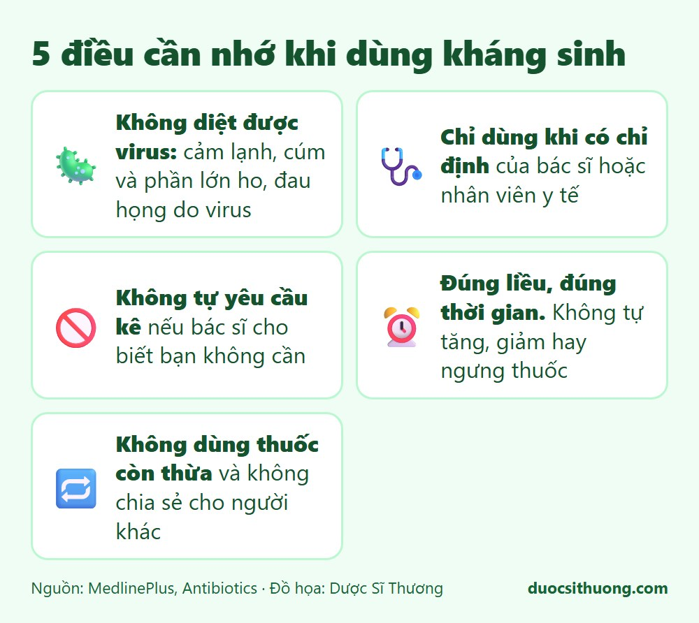
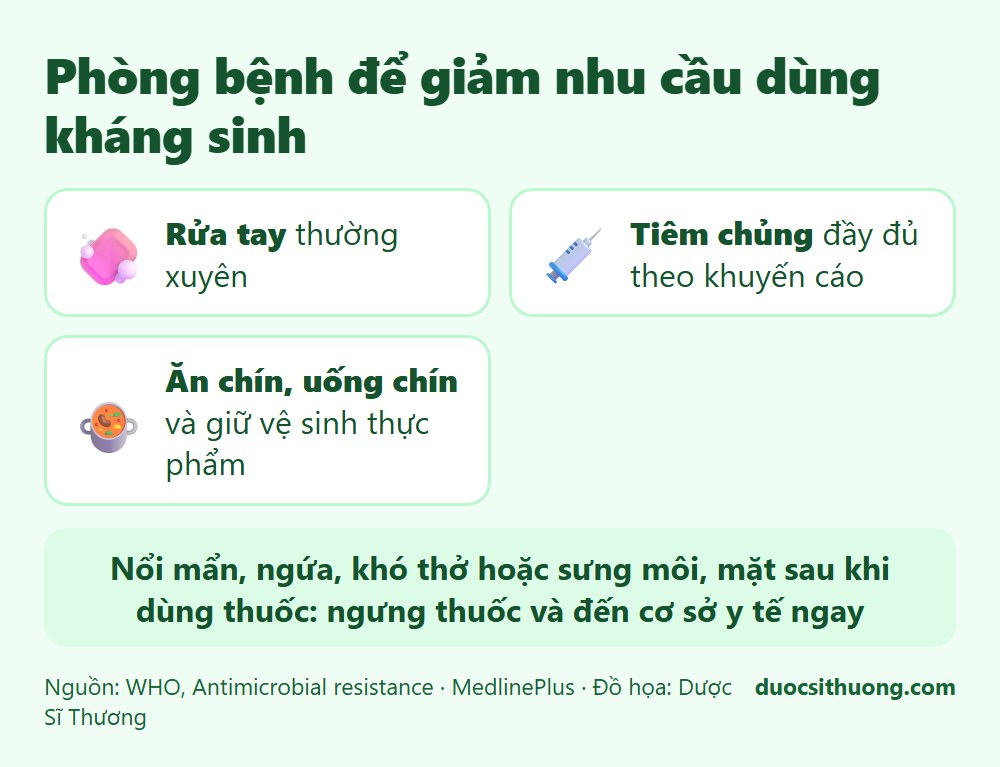

## Tóm tắt nhanh

Kháng sinh là thuốc kê đơn dùng để điều trị **nhiễm khuẩn**. Dùng sai hoặc lạm dụng kháng sinh làm vi khuẩn trở nên kháng thuốc, khiến các bệnh nhiễm khuẩn khó điều trị hơn cho cả bạn và cộng đồng.

## Những điều cần nhớ

*Đồ họa: Dược Sĩ Thương. Nguồn: MedlinePlus.*

- **Kháng sinh không diệt được virus.** Cảm lạnh, cúm và phần lớn các trường hợp ho, đau họng do virus gây ra, nên dùng kháng sinh không giúp ích.
- **Chỉ dùng kháng sinh khi có chỉ định** của bác sĩ hoặc nhân viên y tế có chuyên môn.
- **Không tự yêu cầu kê kháng sinh** nếu bác sĩ cho biết bạn không cần.
- **Dùng đúng liều, đúng thời gian** theo hướng dẫn của bác sĩ hoặc dược sĩ. Không tự ý tăng, giảm hay ngưng thuốc.
- **Không dùng thuốc còn thừa** từ lần điều trị trước và không chia sẻ kháng sinh cho người khác.

## Giảm nhu cầu dùng kháng sinh bằng cách phòng bệnh

*Đồ họa: Dược Sĩ Thương. Nguồn: WHO và MedlinePlus.*

- Rửa tay thường xuyên.
- Tiêm chủng đầy đủ theo khuyến cáo.
- Ăn chín, uống chín và giữ vệ sinh thực phẩm.

## Khi nào cần đi khám?

Hãy đi khám khi bạn bị sốt cao kéo dài, ho hoặc đau họng nhiều ngày không đỡ, đau tai, tiểu buốt, vết thương sưng đỏ và có mủ, hoặc triệu chứng nặng lên nhanh. Đừng tự mua kháng sinh về dùng.

Nếu bạn bị nổi mẩn, ngứa, khó thở hoặc sưng môi, mặt sau khi dùng thuốc, hãy ngưng thuốc và đến cơ sở y tế ngay.
