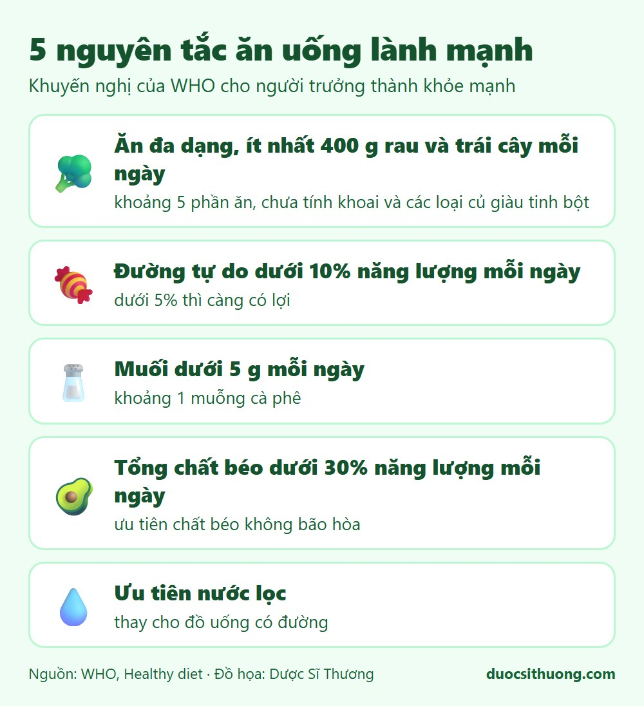
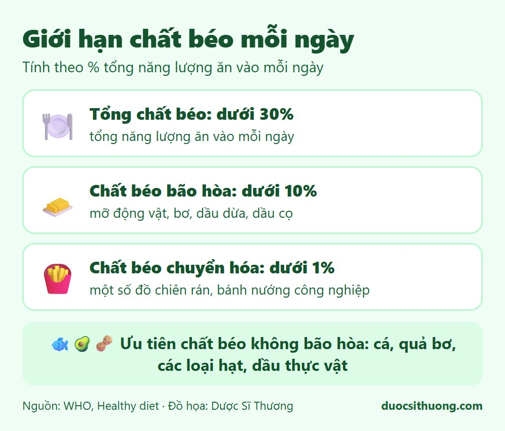

## Tóm tắt nhanh

Ăn uống lành mạnh không cần cầu kỳ. Bạn chỉ cần ăn đa dạng, nhiều rau quả, ít đường, ít muối và ít chất béo không tốt. Các con số dưới đây áp dụng cho **người trưởng thành khỏe mạnh**.

*Đồ họa: Dược Sĩ Thương. Nguồn: WHO, Healthy diet.*

## 1. Ăn đa dạng, nhiều rau và trái cây

Mỗi ngày nên ăn ít nhất **400 g rau và trái cây** (khoảng 5 phần ăn), không tính khoai lang, khoai mì và các loại củ giàu tinh bột. Hãy thêm các loại đậu, hạt và ngũ cốc nguyên hạt vào bữa ăn.

## 2. Hạn chế đường

Lượng đường tự do (đường thêm vào thức ăn, đồ uống, mật ong, nước ép) nên **dưới 10% tổng năng lượng** mỗi ngày. Nếu giảm xuống dưới 5% thì càng có lợi. Nước ngọt, trà sữa và bánh kẹo là nguồn đường tự do phổ biến.

## 3. Hạn chế muối

Nên dùng **dưới 5 g muối mỗi ngày** (khoảng 1 muỗng cà phê). Lưu ý muối còn có trong nước mắm, bột nêm, mì gói, đồ muối chua và thực phẩm chế biến sẵn.

## 4. Chọn loại chất béo phù hợp

- Tổng chất béo nên dưới 30% năng lượng mỗi ngày.
- Chất béo bão hòa (mỡ động vật, bơ, dầu dừa, dầu cọ) nên dưới 10%.
- Chất béo chuyển hóa (có trong một số đồ chiên rán, bánh nướng công nghiệp) nên dưới 1%.
- Ưu tiên chất béo không bão hòa như cá, quả bơ, các loại hạt và dầu thực vật.

*Đồ họa: Dược Sĩ Thương. Nguồn: WHO, Healthy diet.*

## 5. Uống đủ nước lọc

Ưu tiên nước lọc thay cho đồ uống có đường.

## Khi nào cần hỏi ý kiến bác sĩ hoặc dược sĩ?

Những khuyến nghị trên là chung cho người khỏe mạnh. Bạn nên hỏi ý kiến bác sĩ hoặc chuyên gia dinh dưỡng trước khi thay đổi chế độ ăn nếu:

- Bạn có bệnh nền như tiểu đường, tăng huyết áp, bệnh thận, bệnh tim.
- Bạn đang mang thai, cho con bú, hoặc đang chăm sóc trẻ nhỏ và người cao tuổi.
- Bạn đang dùng thuốc điều trị lâu dài.
