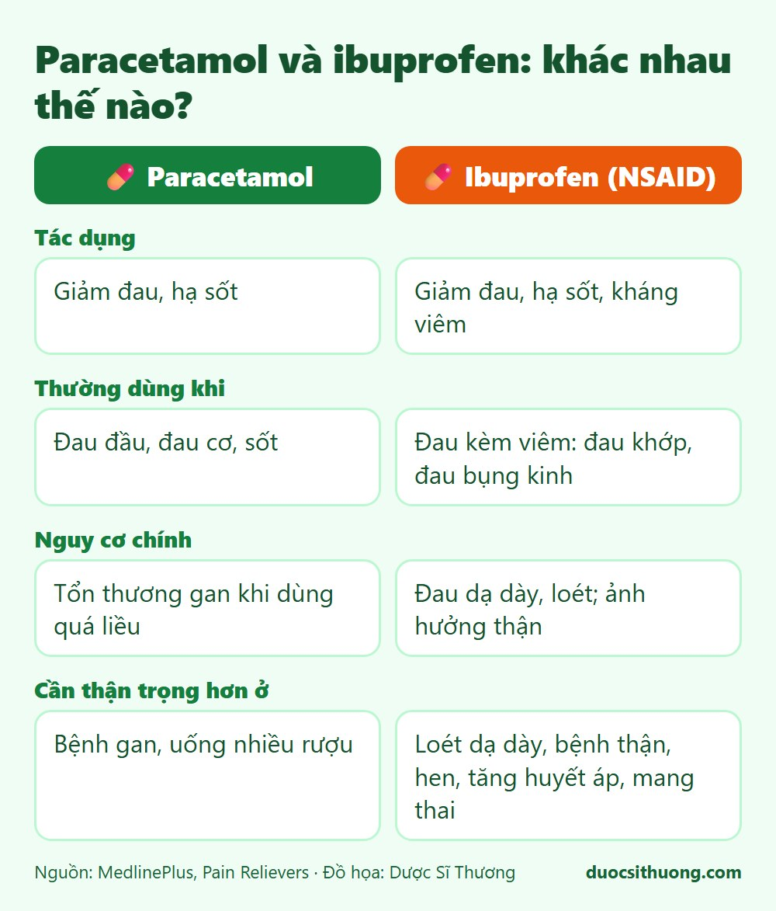
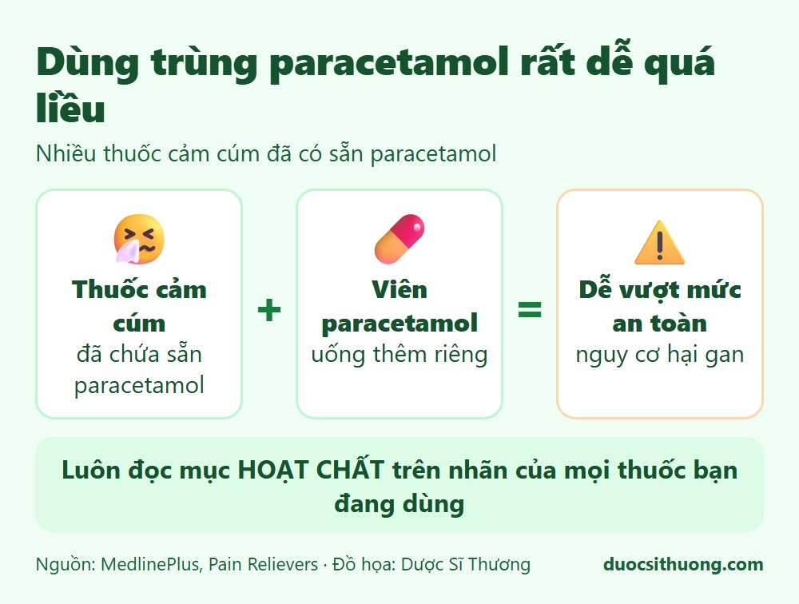

## Tóm tắt nhanh

Paracetamol và ibuprofen đều giúp giảm đau và hạ sốt, nhưng **không giống nhau**. Paracetamol có nguy cơ chính là **tổn thương gan khi dùng quá liều**. Ibuprofen thuộc nhóm thuốc kháng viêm không steroid (NSAID), có thể gây **đau dạ dày, loét** và cần thận trọng với người có bệnh thận, tim mạch. Dù dùng thuốc nào, hãy làm đúng theo nhãn hoặc hướng dẫn của bác sĩ, dược sĩ.

## So sánh nhanh

*Đồ họa: Dược Sĩ Thương. Nguồn: MedlinePlus.*

| | Paracetamol | Ibuprofen |
| --- | --- | --- |
| Tác dụng | Giảm đau, hạ sốt | Giảm đau, hạ sốt, kháng viêm |
| Thường dùng khi | Đau đầu, đau cơ, sốt | Đau kèm viêm như đau khớp, đau bụng kinh |
| Nguy cơ chính | Tổn thương gan khi dùng quá liều | Buồn nôn, đau dạ dày, loét; ảnh hưởng thận |
| Cần thận trọng hơn ở | Người có bệnh gan, người uống nhiều rượu | Người có tiền sử loét dạ dày, bệnh thận, hen, tăng huyết áp, phụ nữ mang thai |

## Những sai lầm hay gặp

*Đồ họa: Dược Sĩ Thương. Nguồn: MedlinePlus.*

- **Dùng trùng paracetamol mà không biết.** Nhiều thuốc cảm cúm, thuốc giảm đau kê đơn đã chứa sẵn paracetamol. Uống thêm một viên paracetamol riêng rất dễ vượt quá lượng an toàn. Hãy đọc kỹ phần **hoạt chất** trên nhãn của mọi thuốc bạn đang dùng.
- **Tự tăng liều hoặc uống dồn** khi chưa hết đau, chưa hạ sốt. Hãy tuân thủ liều và khoảng cách giữa các lần dùng ghi trên nhãn hoặc theo chỉ dẫn của bác sĩ, dược sĩ.
- **Dùng cùng lúc nhiều thuốc kháng viêm** (ví dụ ibuprofen với một thuốc kháng viêm khác), làm tăng nguy cơ tác dụng phụ.
- **Uống ibuprofen khi bụng đói.** Nếu thuốc gây khó chịu dạ dày, hãy uống cùng hoặc sau bữa ăn và hỏi dược sĩ.
- **Dùng kéo dài không có người theo dõi.** Nếu bạn cần dùng thuốc giảm đau quá **10 ngày** (quá **5 ngày** ở trẻ em), hãy đi khám để tìm nguyên nhân thay vì tiếp tục tự dùng.
- **Cho trẻ em dùng aspirin.** Không nên cho trẻ em dùng aspirin khi chưa có chỉ định của bác sĩ.

## Trẻ em, phụ nữ có thai, người cao tuổi

- **Trẻ em:** liều tính theo cân nặng và độ tuổi. Hãy dùng đúng dụng cụ đong kèm thuốc, không dùng thìa ăn cơm, và hỏi dược sĩ hoặc bác sĩ. Trẻ còn rất nhỏ bị sốt cần được bác sĩ khám.
- **Phụ nữ mang thai, cho con bú:** nhiều loại thuốc không an toàn trong thai kỳ. Hãy hỏi bác sĩ trước khi dùng bất kỳ thuốc giảm đau nào, kể cả thuốc không kê đơn.
- **Người cao tuổi hoặc có bệnh nền** (dạ dày, thận, tim mạch, gan): nên hỏi bác sĩ, dược sĩ trước khi tự mua thuốc.

## Khi nào cần đi khám hoặc cấp cứu?

- Sốt cao kéo dài, sốt kèm co giật, cứng cổ, phát ban, khó thở hoặc li bì.
- Đau dữ dội hoặc đau kéo dài, không đỡ khi dùng thuốc.
- Đi ngoài phân đen, nôn ra máu hoặc đau bụng dữ dội sau khi dùng thuốc kháng viêm.
- **Nghi ngờ uống quá liều paracetamol:** hãy đến cơ sở y tế ngay, kể cả khi chưa thấy khó chịu, vì dấu hiệu có thể xuất hiện muộn.

Nếu nghi ngờ mình hoặc người thân đang gặp nguy hiểm, hãy gọi **115**.
