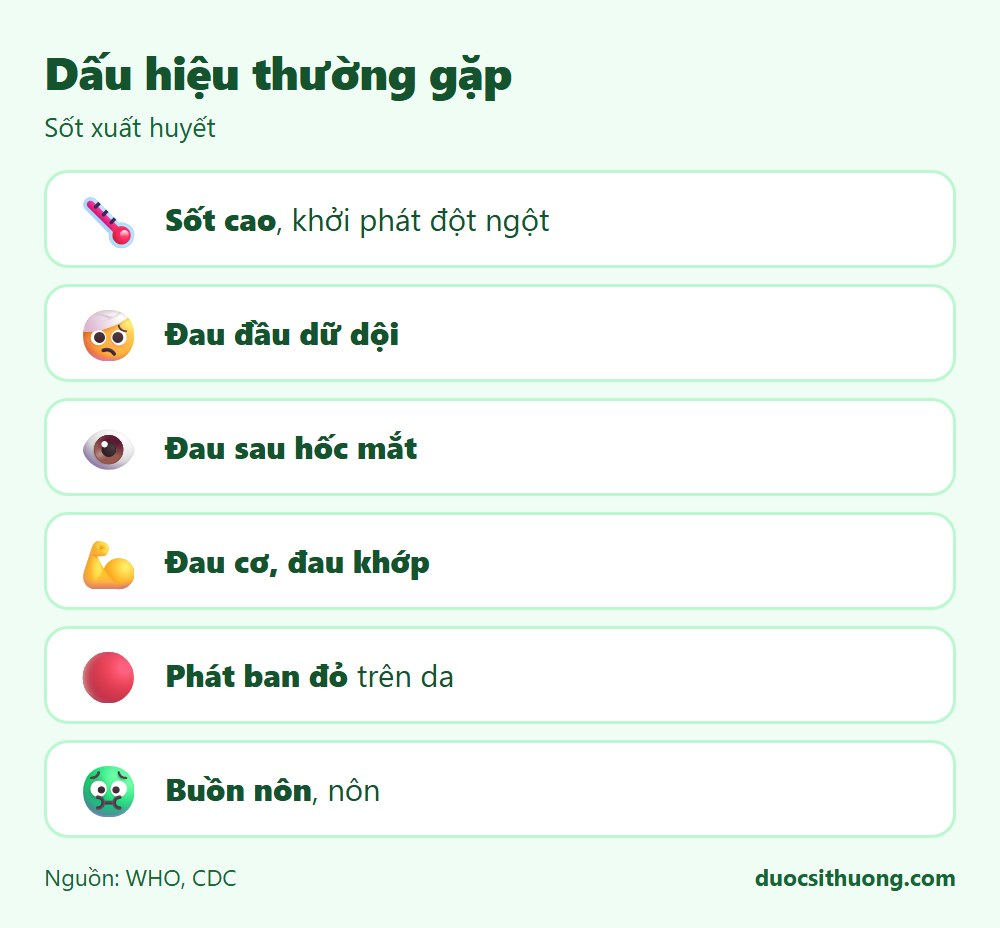
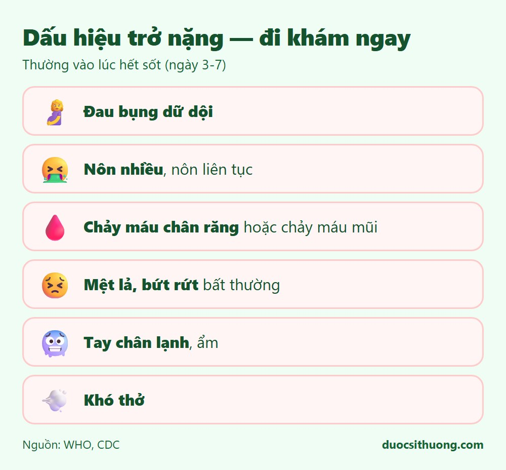

## Tóm tắt nhanh

Sốt xuất huyết là bệnh do virus lây qua **muỗi vằn (Aedes)**, thường gặp ở vùng nhiệt đới, kể cả Việt Nam, hay tăng vào mùa mưa. Phần lớn trường hợp nhẹ và tự khỏi, nhưng **một số người có thể trở nặng nhanh**, thường vào khoảng ngày thứ 3 đến ngày thứ 7, đúng lúc cơn sốt bắt đầu giảm — đây là giai đoạn cần theo dõi sát nhất.

## Dấu hiệu thường gặp

*Đồ họa: Dược Sĩ Thương. Nguồn: WHO, CDC.*

- Sốt cao, khởi phát đột ngột.
- Đau đầu dữ dội.
- Đau sau hốc mắt.
- Đau cơ, đau khớp.
- Phát ban đỏ trên da.
- Buồn nôn, nôn.

## Dấu hiệu cảnh báo trở nặng — cần đi khám ngay

*Đồ họa: Dược Sĩ Thương. Nguồn: WHO, CDC.*

Các dấu hiệu này thường xuất hiện quanh lúc hết sốt, hãy đi khám ngay nếu có:

- Đau bụng dữ dội.
- Nôn nhiều, nôn liên tục.
- Chảy máu chân răng hoặc chảy máu mũi.
- Mệt lả, bứt rứt, khó chịu bất thường.
- Tay chân lạnh, ẩm.
- Khó thở.

Nếu người bệnh lơ mơ, khó thở nặng hoặc chảy máu nhiều, hãy gọi **115** ngay.

## Lưu ý về thuốc

**Không tự ý dùng aspirin hoặc ibuprofen (nhóm NSAID)** khi nghi ngờ sốt xuất huyết, vì có thể làm tăng nguy cơ chảy máu. Nếu cần hạ sốt, giảm đau, nên dùng **paracetamol** theo đúng liều và hỏi ý kiến bác sĩ, dược sĩ nếu chưa chắc chắn.

## Phòng ngừa

- Diệt lăng quăng, loại bỏ các vật dụng đọng nước quanh nhà (nơi muỗi vằn đẻ trứng).
- Ngủ màn kể cả ban ngày, dùng kem hoặc xịt chống muỗi.
- Mặc quần áo dài tay khi ở nơi có nhiều muỗi.
- Dùng lưới hoặc màn chắn ở cửa sổ, cửa ra vào.

Xem thêm: [5 nguyên tắc ăn uống lành mạnh](/an-uong/nguyen-tac-an-uong-lanh-manh/)
