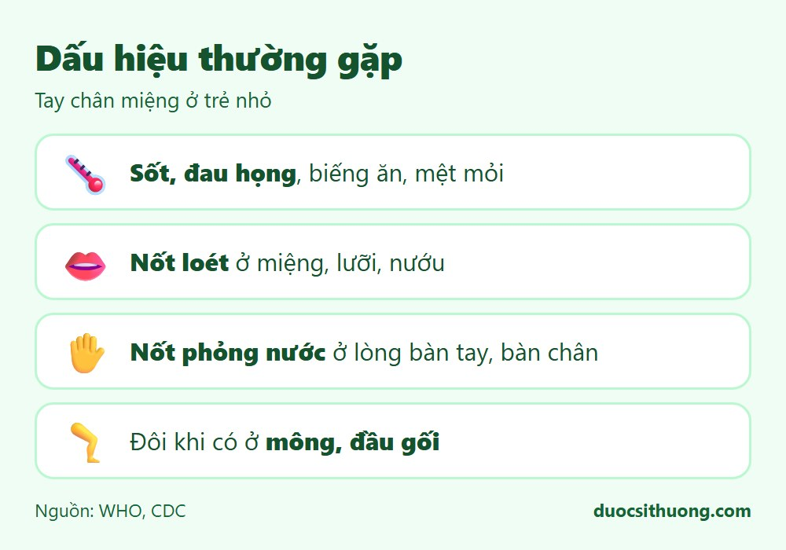
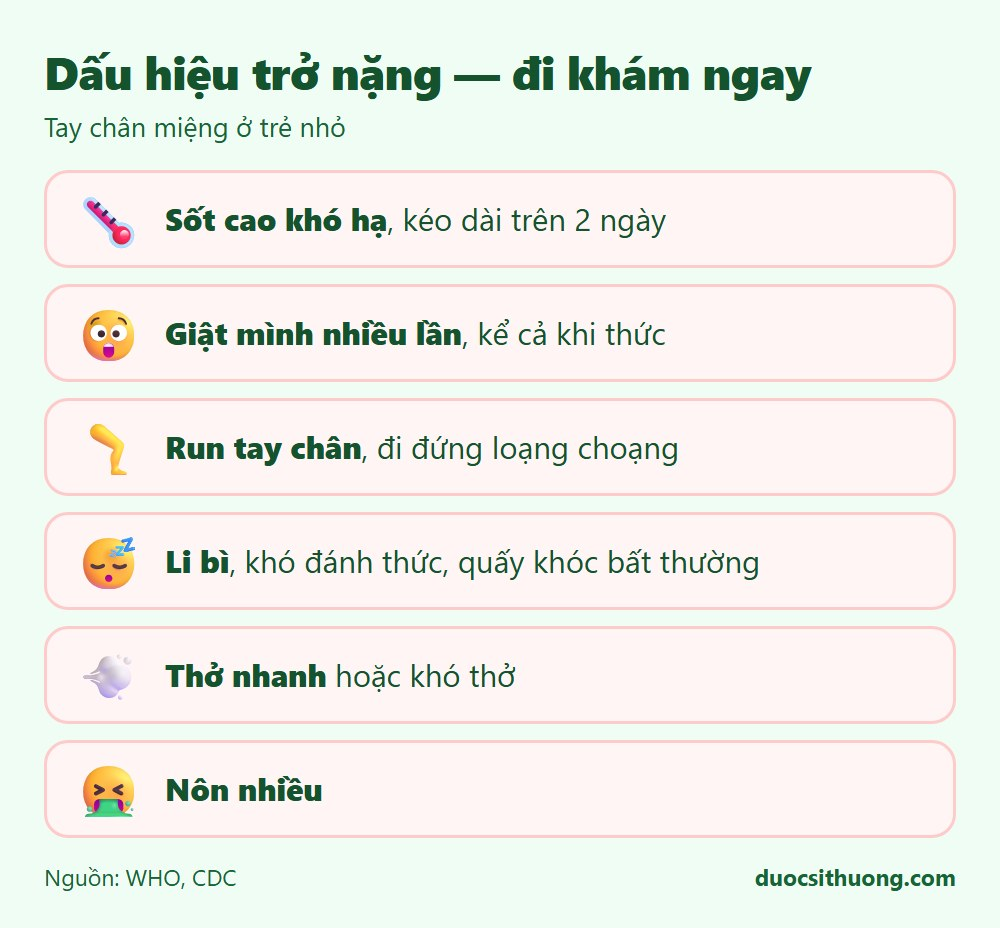

## Tóm tắt nhanh

Tay chân miệng là bệnh do virus, hay gặp ở trẻ dưới 5 tuổi, thường tự khỏi sau 7-10 ngày. Phần lớn trường hợp nhẹ, nhưng **một số ít trẻ có thể trở nặng rất nhanh**, nên cha mẹ cần biết các dấu hiệu cảnh báo để đưa trẻ đi khám kịp thời.

## Dấu hiệu thường gặp

*Đồ họa: Dược Sĩ Thương. Nguồn: CDC, MedlinePlus.*

- Sốt, đau họng, biếng ăn, mệt mỏi.
- Nốt loét đỏ, có thể thành bọng nước ở trong miệng, lưỡi, nướu (gây đau khi ăn, bú).
- Nốt phỏng nước (không ngứa) ở lòng bàn tay, lòng bàn chân, đôi khi ở mông, đầu gối.

## Chăm sóc tại nhà

- Cho trẻ uống nhiều nước, ăn thức ăn mềm, mát, dễ nuốt vì miệng đang đau.
- Dùng thuốc hạ sốt, giảm đau theo đúng liều phù hợp với cân nặng của trẻ (hỏi dược sĩ nếu chưa chắc liều dùng).
- Vệ sinh tay cho trẻ và người chăm sóc thường xuyên; vệ sinh đồ chơi, vật dụng.
- Cho trẻ nghỉ học để tránh lây cho trẻ khác cho đến khi hết các nốt phỏng nước.

## Dấu hiệu trở nặng, cần đi khám hoặc cấp cứu ngay

*Đồ họa: Dược Sĩ Thương. Nguồn: CDC, MedlinePlus. Các dấu hiệu thần kinh (giật mình, run tay chân) cần đối chiếu thêm với hướng dẫn của Bộ Y tế Việt Nam, xem ghi chú kiểm duyệt.*

Đưa trẻ đến cơ sở y tế ngay nếu có bất kỳ dấu hiệu nào sau đây:

- Sốt cao khó hạ, sốt kéo dài trên 2 ngày.
- Giật mình nhiều lần, kể cả khi đang thức.
- Run tay chân, đi đứng loạng choạng.
- Li bì, khó đánh thức, quấy khóc bất thường.
- Thở nhanh, thở mệt hoặc khó thở.
- Nôn nhiều.

Nếu trẻ khó thở, tím tái, co giật hoặc không đánh thức được, hãy gọi **115** ngay.

## Phòng ngừa

- Rửa tay thường xuyên bằng xà phòng cho cả trẻ và người chăm sóc, đặc biệt sau khi thay tã, trước khi ăn.
- Vệ sinh, khử khuẩn đồ chơi và bề mặt hay tiếp xúc.
- Tránh cho trẻ dùng chung khăn, cốc, muỗng với trẻ khác.
- Cách ly trẻ bệnh, không cho đến nhà trẻ, trường học cho đến khi khỏi hẳn.

Xem thêm: [5 nguyên tắc ăn uống lành mạnh](/an-uong/nguyen-tac-an-uong-lanh-manh/)
