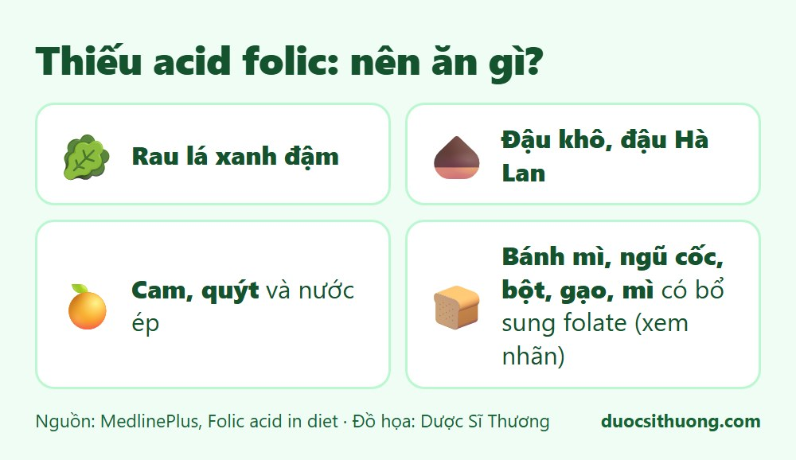
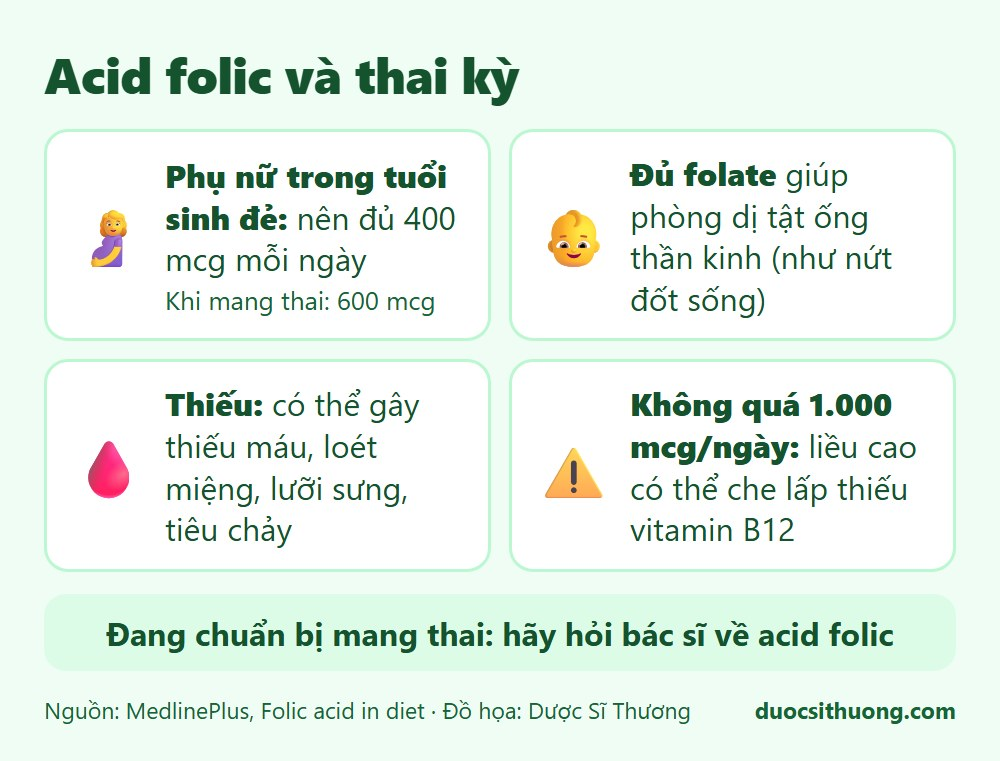

## Tóm tắt nhanh

Acid folic (còn gọi là folate hoặc vitamin B9) giúp mô phát triển, tế bào hoạt động, tạo hồng cầu để phòng một số loại thiếu máu, và tạo DNA. Folate đặc biệt quan trọng với **phụ nữ trong tuổi sinh đẻ**, vì đủ folate giúp phòng dị tật ống thần kinh ở thai nhi.

## Thực phẩm chứa folate

*Đồ họa: Dược Sĩ Thương. Nguồn: MedlinePlus.*

- **Rau lá xanh đậm.**
- **Đậu khô, đậu Hà Lan.**
- **Cam, quýt** và nước ép.
- **Thực phẩm được bổ sung folate:** bánh mì, ngũ cốc, bột, gạo, mì và các sản phẩm từ ngũ cốc. Hãy xem thông tin trên nhãn.

## Acid folic và thai kỳ

*Đồ họa: Dược Sĩ Thương. Nguồn: MedlinePlus.*

- **Phụ nữ trong tuổi sinh đẻ** nên nhận đủ 400 mcg folate mỗi ngày (MedlinePlus nêu là qua viên bổ sung). Khi mang thai cần khoảng 600 mcg, mang song thai cần nhiều hơn.
- **Đủ folate** giúp phòng dị tật ống thần kinh như nứt đốt sống ở thai nhi.
- **Thiếu folate** có thể gây tiêu chảy, loét miệng, lưỡi sưng, chậm lớn và một số loại thiếu máu.
- **Không nên vượt 1.000 mcg mỗi ngày.** Liều cao có thể che lấp tình trạng thiếu vitamin B12, dù nguy cơ này thấp.

## Cần bao nhiêu acid folic?

Theo MedlinePlus (khuyến nghị của Hoa Kỳ): người lành mạnh từ 14 tuổi trở lên cần khoảng 400 mcg mỗi ngày, điều chỉnh theo tuổi và giai đoạn của cuộc sống. Nhu cầu và liều bổ sung của từng người, nhất là phụ nữ chuẩn bị mang thai, cần được bác sĩ tư vấn.

## Khi nào cần đi khám?

**Nếu bạn đang chuẩn bị mang thai hoặc đang mang thai, hãy hỏi bác sĩ về acid folic.** Ngoài ra, hãy đi khám nếu bạn mệt mỏi kéo dài, da xanh xao, loét miệng hay tái đi tái lại, hoặc ăn uống kém kéo dài.

Xem thêm: [Vitamin và khoáng chất: khi nào cần bổ sung?](/kien-thuc-ve-thuoc/vitamin-va-khoang-chat-khi-nao-can-bo-sung/)
