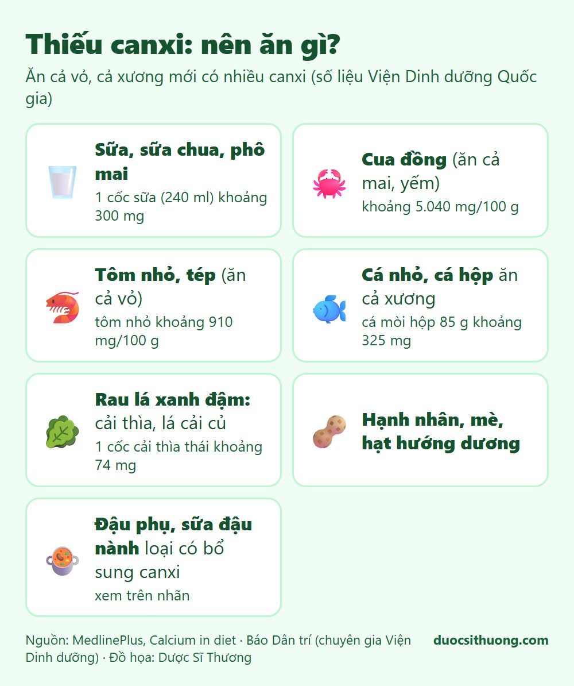
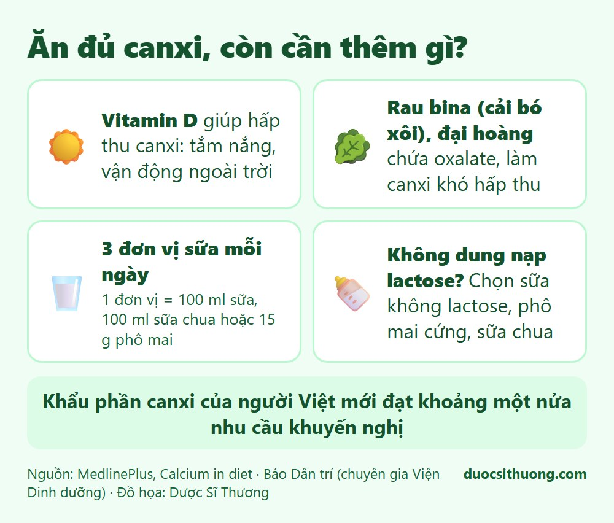

## Tóm tắt nhanh

Canxi giúp xương và răng chắc khỏe. Theo chuyên gia Viện Dinh dưỡng Quốc gia, khẩu phần canxi của người Việt mới đạt khoảng **một nửa** nhu cầu khuyến nghị. Tôm, cua đồng, cá nhỏ **rất giàu canxi, nhưng chỉ khi ăn cả vỏ, cả mai, cả xương**. Nếu bỏ những phần này, lượng canxi giảm đáng kể.

## Canxi giúp gì cho cơ thể?

Canxi cần cho xương và răng chắc khỏe, đông máu, truyền tín hiệu thần kinh, co và giãn cơ, tiết hormone và giữ nhịp tim bình thường.

## Thực phẩm giàu canxi

*Đồ họa: Dược Sĩ Thương. Nguồn: MedlinePlus, Báo Dân trí (Viện Dinh dưỡng Quốc gia).*

- **Sữa và chế phẩm từ sữa:** một cốc sữa (khoảng 240 ml), một hộp sữa chua nhỏ (khoảng 170 g) hoặc khoảng 40 g phô mai đều cho khoảng 300 mg canxi.
- **Cua đồng, tôm nhỏ, tép:** theo Viện Dinh dưỡng, cua đồng khoảng 5.040 mg canxi/100 g, tôm nhỏ khoảng 910 mg/100 g. Điều kiện là **ăn cả mai, yếm cua và cả vỏ tôm**.
- **Cá nhỏ, cá hộp ăn cả xương:** khoảng 85 g cá mòi hộp (còn xương) cho khoảng 325 mg canxi.
- **Rau lá xanh đậm** như cải thìa, lá cải củ: một cốc cải thìa thái nhỏ khoảng 74 mg, nửa cốc lá cải củ nấu chín khoảng 100 mg.
- **Các loại hạt và đậu:** hạnh nhân (khoảng 100 mg mỗi ¼ cốc), hạt hướng dương, mè, đậu khô.
- **Thực phẩm có bổ sung canxi:** đậu phụ, sữa đậu nành, nước cam, ngũ cốc. Hãy xem thông tin trên nhãn.

## Để cơ thể hấp thu canxi tốt hơn

*Đồ họa: Dược Sĩ Thương. Nguồn: MedlinePlus, Báo Dân trí (Viện Dinh dưỡng Quốc gia).*

- **Cần vitamin D** để hấp thu canxi. Tắm nắng đúng cách và vận động ngoài trời giúp cơ thể có vitamin D.
- **Rau bina (cải bó xôi), đại hoàng** chứa oxalate, và cám lúa mì cũng có thể gắn với canxi làm giảm hấp thu.
- Theo Viện Dinh dưỡng, người trưởng thành nên dùng khoảng **3 đơn vị sữa và chế phẩm mỗi ngày** (1 đơn vị là 15 g phô mai, 100 ml sữa chua hoặc 100 ml sữa). Trung bình người Việt mới uống khoảng 74 ml sữa mỗi ngày.
- Khẩu phần có **tỉ số canxi/phospho thấp** (dưới 0,8) làm giảm hấp thu canxi.
- **Không dung nạp lactose:** chọn sữa không lactose, phô mai cứng, sữa chua.

## Cần bao nhiêu canxi mỗi ngày?

Theo MedlinePlus (khuyến nghị của Hoa Kỳ), người 19 đến 50 tuổi cần khoảng 1.000 mg mỗi ngày. Phụ nữ từ 51 tuổi và mọi người trên 70 tuổi cần khoảng 1.200 mg. Nhu cầu của từng người, nhất là trẻ em, phụ nữ mang thai, người cao tuổi, cần được bác sĩ hoặc chuyên gia dinh dưỡng tư vấn.

## Thiếu và thừa canxi

- **Thiếu canxi kéo dài** có thể dẫn đến loãng xương và một số rối loạn khác.
- **Thừa canxi kéo dài**, nhất là do tự uống viên bổ sung liều cao, làm tăng nguy cơ sỏi thận ở một số người. Đừng tự ý uống canxi liều cao.

## Khi nào cần đi khám?

Hãy hỏi bác sĩ nếu bạn có nguy cơ loãng xương (phụ nữ sau mãn kinh, người cao tuổi, người từng gãy xương do va chạm nhẹ, người dùng corticoid kéo dài), nếu đau xương kéo dài, hoặc nếu trẻ chậm lớn. Bác sĩ sẽ đánh giá và chỉ định xét nghiệm hoặc đo mật độ xương khi cần, trước khi cân nhắc viên bổ sung.

Xem thêm: [Vitamin và khoáng chất: khi nào cần bổ sung?](/kien-thuc-ve-thuoc/vitamin-va-khoang-chat-khi-nao-can-bo-sung/)
