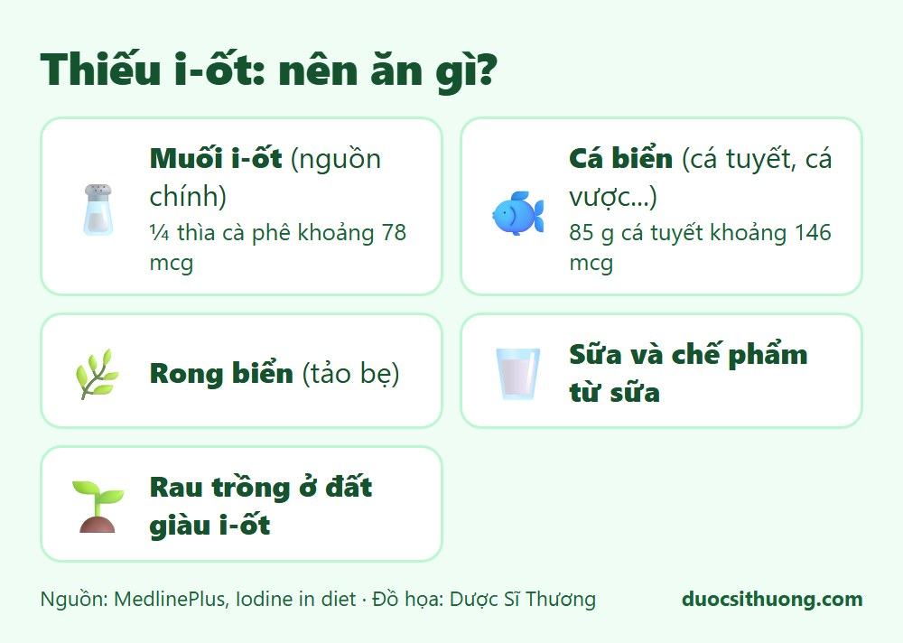
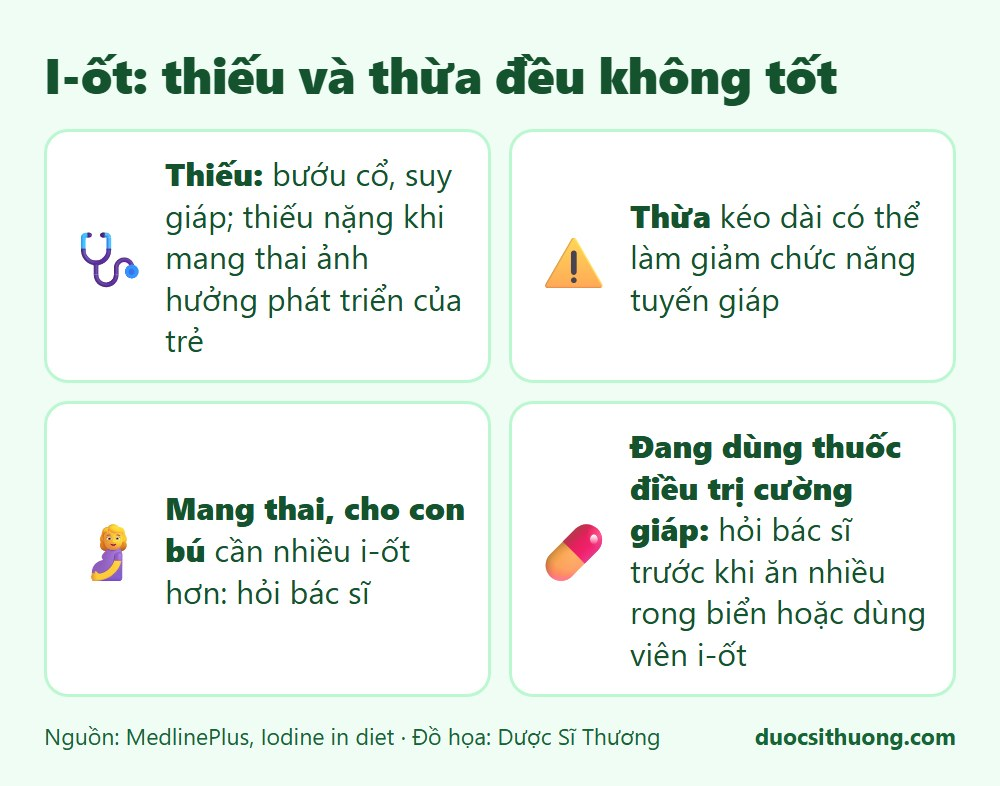

## Tóm tắt nhanh

I-ốt giúp tế bào chuyển thức ăn thành năng lượng và cần cho **tuyến giáp** tạo hormone. Thiếu i-ốt có thể gây bướu cổ và suy giáp, còn **thừa i-ốt kéo dài cũng có thể làm giảm chức năng tuyến giáp**. Vì vậy, cần đủ chứ không nên dùng quá nhiều.

## Thực phẩm chứa i-ốt

*Đồ họa: Dược Sĩ Thương. Nguồn: MedlinePlus.*

- **Muối i-ốt** là nguồn chính: khoảng ¼ thìa cà phê có khoảng 78 mcg i-ốt.
- **Cá biển** như cá tuyết, cá vược: khoảng 85 g cá tuyết cho khoảng 146 mcg.
- **Rong biển** (tảo bẹ).
- **Sữa và các chế phẩm từ sữa.**
- **Rau trồng ở đất giàu i-ốt.**

## Thiếu và thừa i-ốt

*Đồ họa: Dược Sĩ Thương. Nguồn: MedlinePlus.*

- **Thiếu i-ốt:** có thể gây bướu cổ (tuyến giáp to) và suy giáp. Thiếu nặng khi mang thai có thể ảnh hưởng nghiêm trọng đến sự phát triển thể chất và trí tuệ của trẻ. Tình trạng thiếu hay gặp hơn ở phụ nữ, phụ nữ mang thai và trẻ lớn.
- **Thừa i-ốt:** lượng rất cao có thể làm giảm chức năng tuyến giáp. Dùng i-ốt liều cao cùng thuốc kháng giáp có thể gây suy giáp.

## Cần bao nhiêu i-ốt?

Theo MedlinePlus (khuyến nghị của Hoa Kỳ): trẻ 1 đến 8 tuổi 90 mcg mỗi ngày, 9 đến 13 tuổi 120 mcg, thanh thiếu niên và người lớn 150 mcg, phụ nữ mang thai 220 mcg, phụ nữ cho con bú 290 mcg.

## Ai cần hỏi bác sĩ?

- **Phụ nữ mang thai, đang cho con bú:** nhu cầu i-ốt cao hơn, cần bác sĩ tư vấn.
- **Người bị bệnh tuyến giáp hoặc đang dùng thuốc điều trị cường giáp:** hãy hỏi bác sĩ trước khi ăn nhiều rong biển hoặc dùng viên bổ sung i-ốt.

## Khi nào cần đi khám?

Hãy đi khám nếu bạn thấy cổ to bất thường, mệt mỏi, sợ lạnh, tăng cân không rõ nguyên nhân, hoặc đang chuẩn bị mang thai. Bác sĩ sẽ khám, xét nghiệm chức năng tuyến giáp và tư vấn cách bổ sung phù hợp.

Xem thêm: [Vitamin và khoáng chất: khi nào cần bổ sung?](/kien-thuc-ve-thuoc/vitamin-va-khoang-chat-khi-nao-can-bo-sung/)
