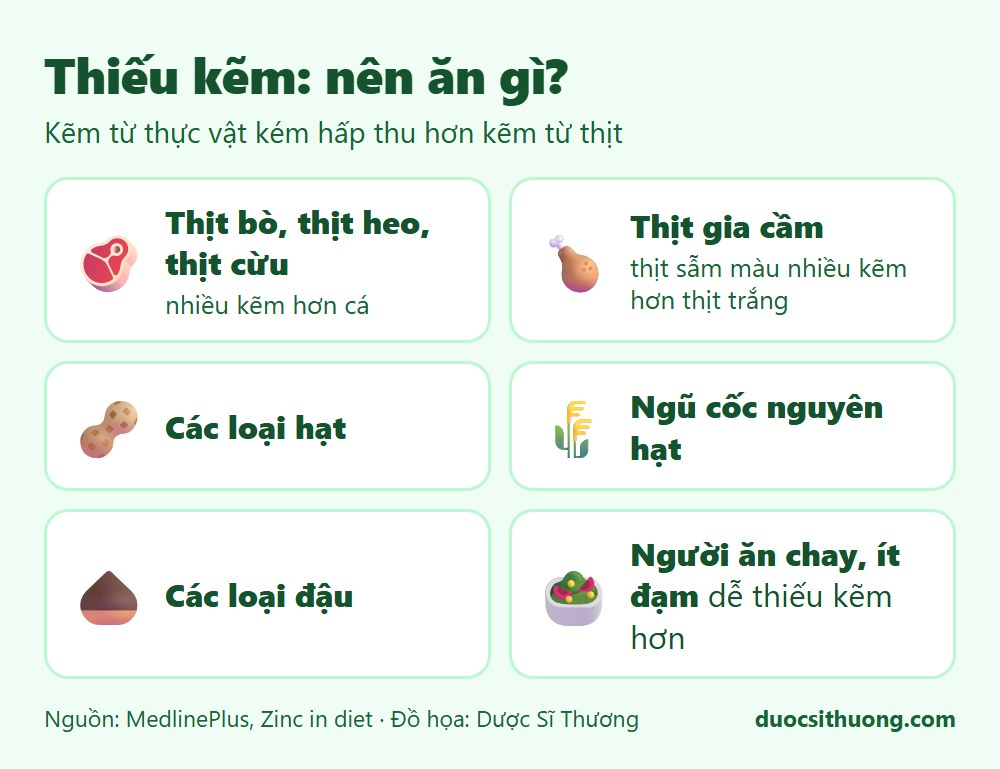
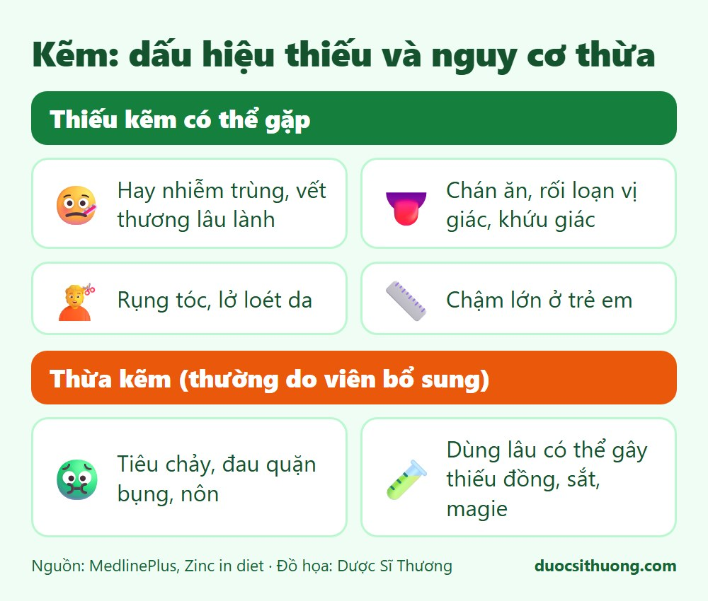

## Tóm tắt nhanh

Kẽm giúp hệ miễn dịch hoạt động, tế bào phân chia và tăng trưởng, vết thương mau lành, và giữ vị giác, khứu giác. Kẽm đặc biệt quan trọng khi mang thai, ở trẻ nhỏ và tuổi dậy thì. **Kẽm từ thực vật kém hấp thu hơn kẽm từ thịt.**

## Thực phẩm giàu kẽm

*Đồ họa: Dược Sĩ Thương. Nguồn: MedlinePlus.*

- **Thịt bò, thịt heo, thịt cừu:** có nhiều kẽm hơn cá.
- **Thịt gia cầm:** thịt sẫm màu (như đùi gà) nhiều kẽm hơn thịt trắng.
- **Các loại hạt, ngũ cốc nguyên hạt, các loại đậu.** Kẽm từ thực vật khó hấp thu hơn.
- Nhiều tài liệu dinh dưỡng cũng nêu **hải sản có vỏ như hàu** là nguồn kẽm rất giàu.

Người ăn chay hoặc ăn ít đạm dễ bị thiếu kẽm hơn.

## Dấu hiệu thiếu và nguy cơ thừa

*Đồ họa: Dược Sĩ Thương. Nguồn: MedlinePlus.*

**Thiếu kẽm có thể gặp:** hay bị nhiễm trùng, vết thương lâu lành, chán ăn, rối loạn vị giác và khứu giác, rụng tóc, lở loét da, chậm lớn ở trẻ em. **Những dấu hiệu này có nhiều nguyên nhân khác**, nên không dùng để tự chẩn đoán.

**Thừa kẽm** (thường do viên bổ sung): có thể gây tiêu chảy, đau quặn bụng, nôn trong vòng vài giờ. Dùng liều cao kéo dài có thể gây thiếu đồng, sắt, magie. Một số dạng xịt, gel bôi mũi chứa kẽm có thể làm mất khứu giác.

## Cần bao nhiêu kẽm?

Theo MedlinePlus (khuyến nghị của Hoa Kỳ): trẻ 1 đến 3 tuổi 3 mg mỗi ngày, 4 đến 8 tuổi 5 mg, nam từ 14 tuổi 11 mg, nữ từ 19 tuổi 8 mg, phụ nữ mang thai 11 đến 12 mg. Nhu cầu của từng người cần được bác sĩ hoặc chuyên gia dinh dưỡng tư vấn.

## Khi nào cần đi khám?

Hãy đi khám nếu trẻ chậm lớn, biếng ăn kéo dài, hay ốm vặt; hoặc người lớn có vết thương lâu lành, rụng tóc nhiều, mất vị giác hay khứu giác. **Đừng tự uống viên kẽm liều cao** khi chưa có ý kiến của bác sĩ, dược sĩ.

Xem thêm: [Vitamin và khoáng chất: khi nào cần bổ sung?](/kien-thuc-ve-thuoc/vitamin-va-khoang-chat-khi-nao-can-bo-sung/)
