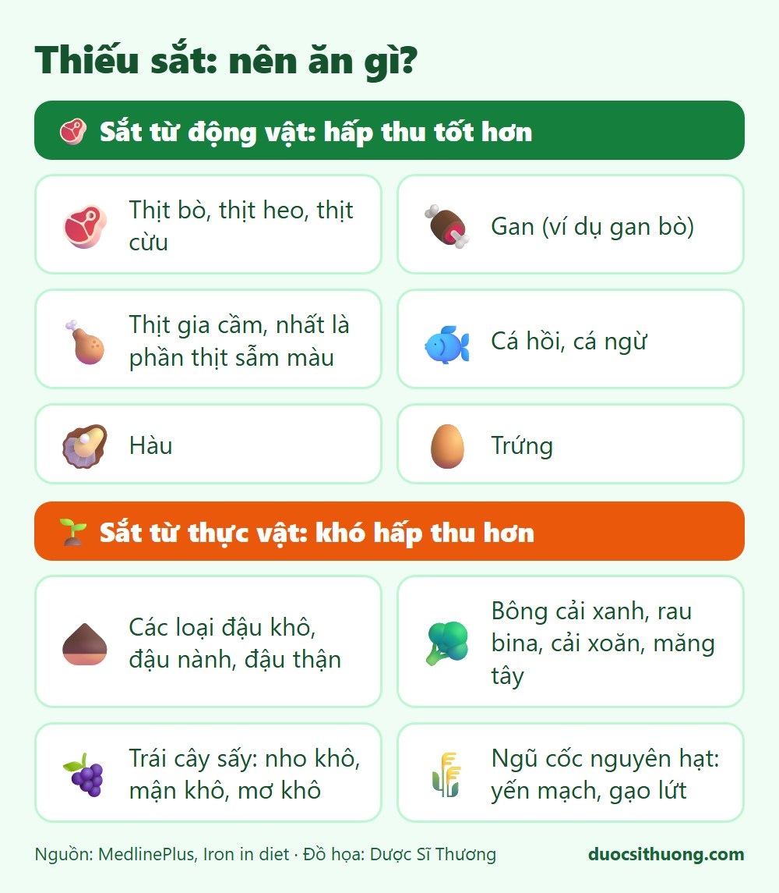
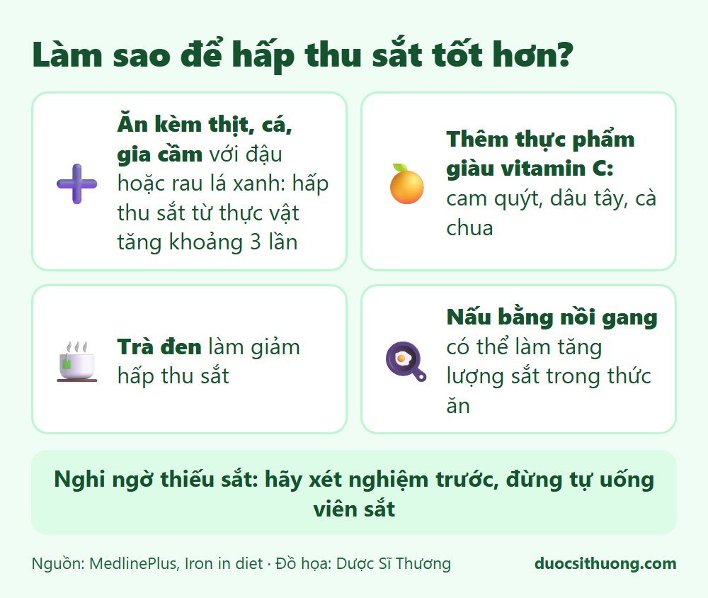

## Tóm tắt nhanh

Sắt giúp cơ thể tạo hemoglobin trong hồng cầu và myoglobin trong cơ, có nhiệm vụ vận chuyển oxy. Sắt trong thực phẩm có nguồn gốc **động vật hấp thu tốt hơn** sắt từ thực vật. Nếu nghi ngờ thiếu sắt, hãy **xét nghiệm trước**, đừng tự uống viên sắt.

## Thực phẩm giàu sắt

*Đồ họa: Dược Sĩ Thương. Nguồn: MedlinePlus.*

**Từ động vật (hấp thu tốt hơn):**

- Thịt bò, thịt heo, thịt cừu, gan.
- Thịt gia cầm, nhất là phần thịt sẫm màu.
- Cá hồi, cá ngừ, hàu.
- Trứng.

**Từ thực vật (khó hấp thu hơn):**

- Các loại đậu khô, đậu nành, đậu thận.
- Rau như bông cải xanh, rau bina (cải bó xôi), cải xoăn, măng tây.
- Trái cây sấy như nho khô, mận khô, mơ khô.
- Các loại hạt (như hạnh nhân) và ngũ cốc nguyên hạt (yến mạch, gạo lứt).

## Làm sao để hấp thu sắt tốt hơn?

*Đồ họa: Dược Sĩ Thương. Nguồn: MedlinePlus.*

- **Ăn kèm thịt, cá hoặc gia cầm với đậu, rau lá xanh:** cách này có thể giúp hấp thu sắt từ thực vật tăng khoảng 3 lần.
- **Thêm thực phẩm giàu vitamin C** như cam quýt, dâu tây, cà chua.
- **Trà đen** làm giảm hấp thu sắt, nên hạn chế uống trà đặc cùng bữa ăn.
- **Nấu bằng nồi gang** có thể làm tăng lượng sắt trong thức ăn.

## Ai dễ thiếu sắt?

- Phụ nữ hành kinh nhiều, phụ nữ mang thai và sau sinh.
- Người chạy đường dài, người hiến máu thường xuyên.
- Người bị chảy máu đường tiêu hóa hoặc có vấn đề hấp thu.
- Trẻ nhỏ không bú mẹ mà không dùng sữa công thức bổ sung sắt, và trẻ uống quá nhiều sữa bò.

## Dấu hiệu có thể gặp

Thiếu sắt có thể gây thiếu năng lượng, khó thở, đau đầu, cáu gắt, chóng mặt, sụt cân. Đôi khi lưỡi nhợt, móng tay hình thìa. **Những dấu hiệu này có thể do nhiều nguyên nhân khác**, nên không dùng để tự chẩn đoán. Cần xét nghiệm máu và khám bác sĩ.

## Thừa sắt cũng nguy hiểm

- Một số người bị bệnh nhiễm sắt (hemochromatosis) tích tụ quá nhiều sắt trong cơ thể.
- **Trẻ em có thể bị ngộ độc** khi uống nhiều viên bổ sung sắt, gây mệt, buồn nôn, nôn, đau đầu, da xám. Hãy để viên sắt **xa tầm tay trẻ em**. Nếu nghi trẻ uống nhầm, đưa đến cơ sở y tế ngay.

## Khi nào cần đi khám?

Hãy đi khám nếu bạn mệt mỏi kéo dài, da xanh xao, hồi hộp, khó thở khi gắng sức, kinh nguyệt ra nhiều, đi ngoài phân đen, hoặc đang mang thai. Bác sĩ sẽ xét nghiệm và quyết định có cần bổ sung sắt hay không.

Xem thêm: [Vitamin và khoáng chất: khi nào cần bổ sung?](/kien-thuc-ve-thuoc/vitamin-va-khoang-chat-khi-nao-can-bo-sung/)
