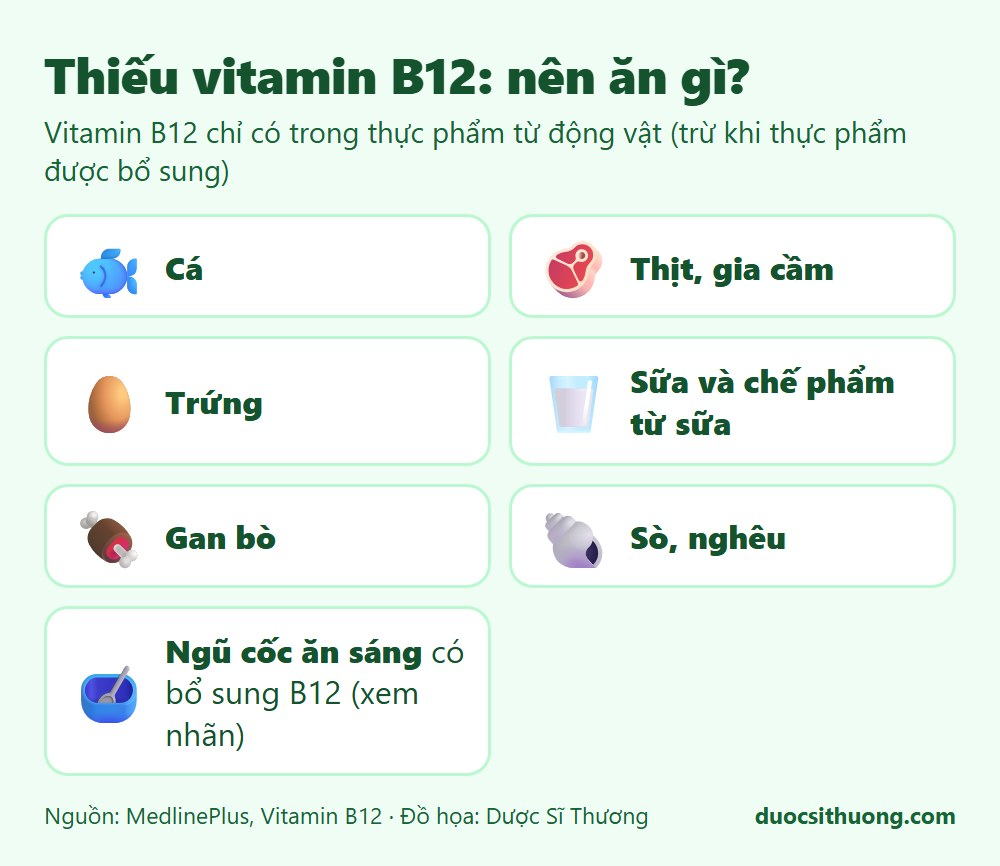
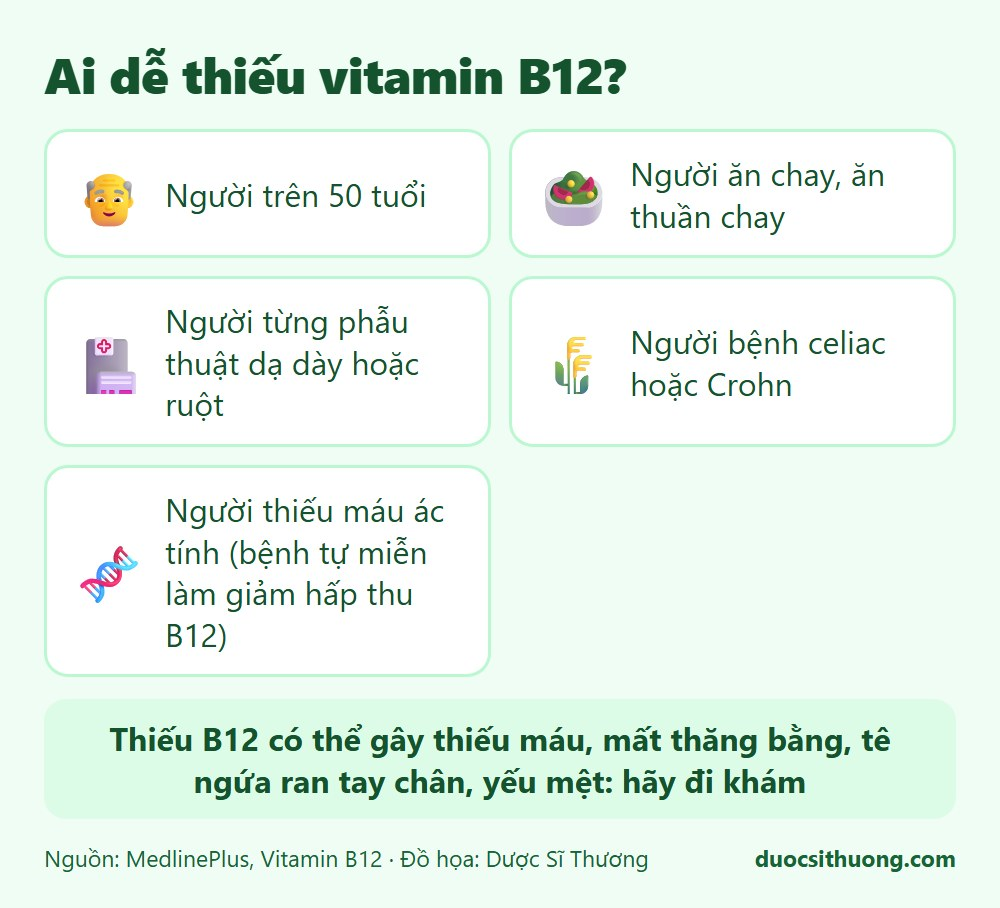

## Tóm tắt nhanh

Vitamin B12 cần cho chuyển hóa protein, tạo hồng cầu và duy trì hệ thần kinh. B12 có trong thực phẩm **từ động vật**; thực vật **không có B12 trừ khi được bổ sung**. Vì vậy người ăn chay và một số nhóm người khác dễ bị thiếu.

## Thực phẩm giàu vitamin B12

*Đồ họa: Dược Sĩ Thương. Nguồn: MedlinePlus.*

- Cá, thịt, gia cầm.
- Trứng.
- Sữa và các chế phẩm từ sữa.
- Gan bò và các loại nhuyễn thể như sò, nghêu.
- Ngũ cốc ăn sáng và một số thực phẩm được bổ sung B12 (xem trên nhãn).

## Ai dễ thiếu vitamin B12?

*Đồ họa: Dược Sĩ Thương. Nguồn: MedlinePlus.*

- Người trên 50 tuổi.
- Người ăn chay, ăn thuần chay.
- Người từng phẫu thuật dạ dày hoặc ruột.
- Người bị bệnh celiac hoặc bệnh Crohn.
- Người bị thiếu máu ác tính (một bệnh tự miễn làm giảm hấp thu B12).

## Dấu hiệu có thể gặp

Thiếu B12 có thể gây thiếu máu, mất thăng bằng, tê hoặc ngứa ran ở tay chân, yếu mệt, và có thể ảnh hưởng đến trí nhớ. **Những dấu hiệu này có thể do nhiều nguyên nhân**, nên cần đi khám và xét nghiệm, không tự chẩn đoán.

## Cần bao nhiêu vitamin B12?

Theo MedlinePlus (khuyến nghị của Hoa Kỳ): người từ 14 tuổi trở lên khoảng 2,4 mcg mỗi ngày, phụ nữ mang thai 2,6 mcg, phụ nữ cho con bú 2,8 mcg. Người ăn chay hoặc người có vấn đề hấp thu cần hỏi bác sĩ về việc bổ sung, vì chỉ ăn thêm thực phẩm có thể chưa đủ.

## Khi nào cần đi khám?

Hãy đi khám nếu bạn ăn chay lâu ngày, trên 50 tuổi mà mệt mỏi kéo dài, tê bì tay chân, đi lại loạng choạng, da xanh xao, hoặc từng phẫu thuật dạ dày, ruột. Bác sĩ sẽ xét nghiệm và quyết định cách bổ sung phù hợp.

Xem thêm: [Vitamin và khoáng chất: khi nào cần bổ sung?](/kien-thuc-ve-thuoc/vitamin-va-khoang-chat-khi-nao-can-bo-sung/)
