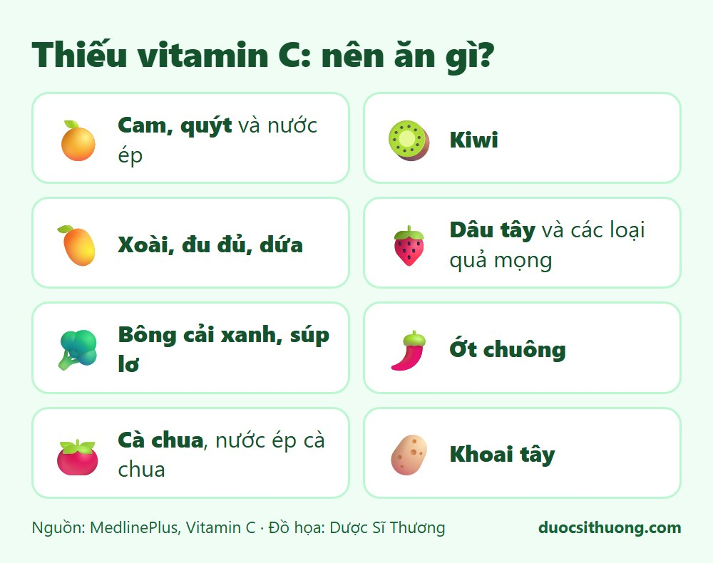
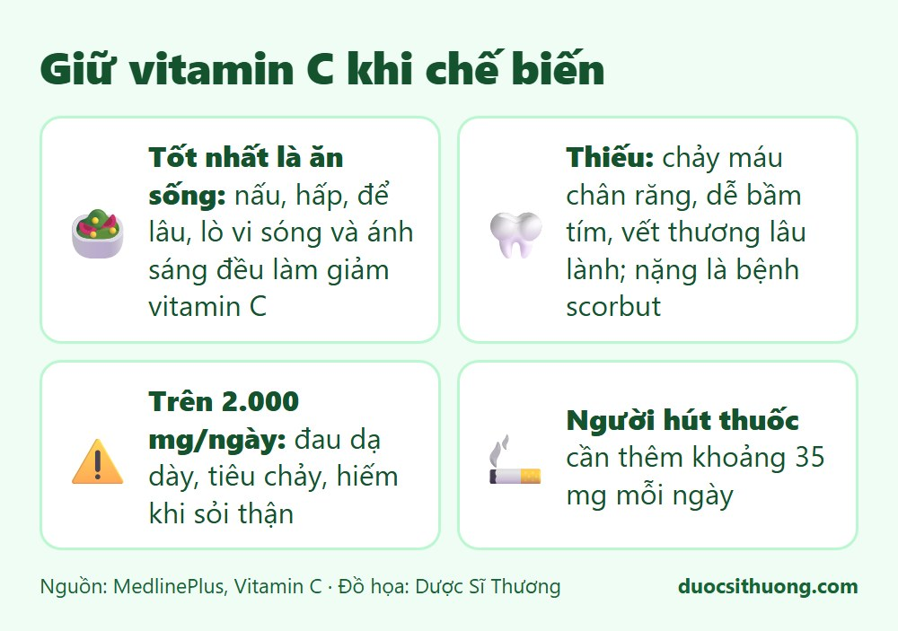

## Tóm tắt nhanh

Vitamin C giúp tạo collagen cho da, gân, dây chằng và mạch máu, giúp vết thương mau lành, sửa chữa sụn, xương, răng, giúp hấp thu sắt và có tác dụng chống oxy hóa. Nguồn tốt nhất là **rau quả tươi, ăn sống**. Nấu nướng và để lâu làm giảm lượng vitamin C.

## Rau quả giàu vitamin C

*Đồ họa: Dược Sĩ Thương. Nguồn: MedlinePlus.*

- **Trái cây:** cam, quýt và nước ép, kiwi, xoài, đu đủ, dứa, dâu tây và các loại quả mọng, dưa hấu. Ổi cũng thường được nhắc đến là loại quả giàu vitamin C.
- **Rau:** bông cải xanh, súp lơ, ớt chuông, rau lá xanh, cà chua, khoai tây, bí.

## Giữ vitamin C khi chế biến

*Đồ họa: Dược Sĩ Thương. Nguồn: MedlinePlus.*

- **Ăn sống khi có thể.** Nấu chín, hấp, để lâu, dùng lò vi sóng và để dưới ánh sáng đều làm giảm vitamin C.
- Khi nấu, nên nấu nhanh và dùng ít nước.

## Thiếu và thừa vitamin C

- **Thiếu:** có thể gây chảy máu chân răng, dễ bầm tím, vết thương lâu lành, viêm lợi, chảy máu cam, da sần, đau khớp, giảm sức đề kháng. Thiếu nặng gây bệnh **scorbut** (hay gặp ở người cao tuổi suy dinh dưỡng). Những dấu hiệu này có nhiều nguyên nhân khác, nên cần đi khám.
- **Thừa:** dùng trên khoảng 2.000 mg mỗi ngày (thường do viên bổ sung) có thể gây đau dạ dày, tiêu chảy, hiếm khi sỏi thận. Dùng liều lớn khi mang thai có thể gây thiếu vitamin C ở trẻ sau sinh.

## Cần bao nhiêu vitamin C?

Theo MedlinePlus (khuyến nghị của Hoa Kỳ): nam giới trưởng thành khoảng 90 mg mỗi ngày, nữ giới 75 mg, phụ nữ mang thai 85 mg, phụ nữ cho con bú 120 mg. Người hút thuốc lá cần thêm khoảng 35 mg mỗi ngày.

## Khi nào cần đi khám?

Hãy đi khám nếu bạn bị chảy máu chân răng hoặc chảy máu cam kéo dài, dễ bầm tím, vết thương lâu lành, hoặc ăn uống kém kéo dài (nhất là người cao tuổi). Không nên tự uống vitamin C liều rất cao khi chưa hỏi bác sĩ, dược sĩ.

Xem thêm: [Vitamin và khoáng chất: khi nào cần bổ sung?](/kien-thuc-ve-thuoc/vitamin-va-khoang-chat-khi-nao-can-bo-sung/)
