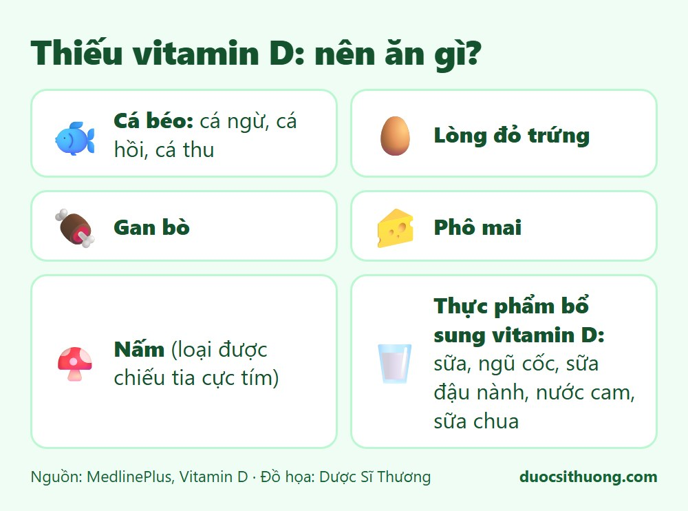
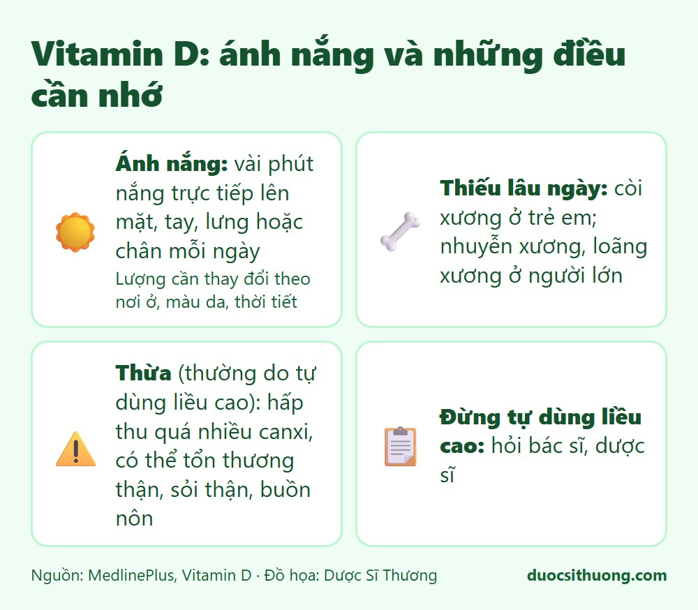

## Tóm tắt nhanh

Vitamin D giúp cơ thể **hấp thu canxi**, cần cho xương phát triển bình thường. Cơ thể có thể tự tạo vitamin D khi da tiếp xúc với ánh nắng, và ta cũng nhận thêm từ một số thực phẩm. Thiếu vitamin D lâu ngày làm xương yếu. Nhưng **tự dùng liều cao cũng có hại**.

## Thực phẩm chứa vitamin D

*Đồ họa: Dược Sĩ Thương. Nguồn: MedlinePlus.*

- **Cá béo:** cá ngừ, cá hồi, cá thu.
- **Lòng đỏ trứng, gan bò, phô mai.**
- **Nấm** (đặc biệt loại bán ở cửa hàng đã được chiếu tia cực tím).
- **Thực phẩm được bổ sung vitamin D:** sữa, ngũ cốc, sữa đậu nành, nước cam, sữa chua. Hãy xem trên nhãn.

## Ánh nắng và những điều cần nhớ

*Đồ họa: Dược Sĩ Thương. Nguồn: MedlinePlus.*

- **Ánh nắng:** theo MedlinePlus, vài phút nắng trực tiếp lên mặt, tay, lưng hoặc chân (không thoa kem chống nắng) mỗi ngày có thể giúp cơ thể tạo đủ vitamin D. Lượng cần thiết thay đổi theo nơi ở, màu da và thời tiết. Không nên phơi nắng gắt quá lâu để tránh cháy nắng.
- **Thiếu lâu ngày:** gây còi xương ở trẻ em, nhuyễn xương hoặc loãng xương ở người lớn.
- **Thừa vitamin D** (thường do tự dùng liều cao): làm ruột hấp thu quá nhiều canxi, có thể gây lắng đọng canxi ở mô mềm, tổn thương thận, sỏi thận, lú lẫn, buồn nôn, nôn, sụt cân.

## Cần bao nhiêu vitamin D?

Theo MedlinePlus (khuyến nghị của Hoa Kỳ): trẻ sơ sinh 400 IU mỗi ngày, người 19 đến 70 tuổi 600 IU, người trên 70 tuổi 800 IU. Nhu cầu của từng người cần được bác sĩ tư vấn, nhất là người cao tuổi, phụ nữ mang thai và trẻ nhỏ.

## Khi nào cần đi khám?

Hãy hỏi bác sĩ nếu bạn ít ra nắng, có nguy cơ loãng xương, đau xương kéo dài, hoặc nếu trẻ có dấu hiệu chậm lớn, biến dạng xương. **Đừng tự mua vitamin D liều cao để uống.** Bác sĩ sẽ đánh giá và xét nghiệm khi cần.

Xem thêm: [Thiếu canxi nên ăn gì?](/an-uong/thieu-canxi-nen-an-gi/)
