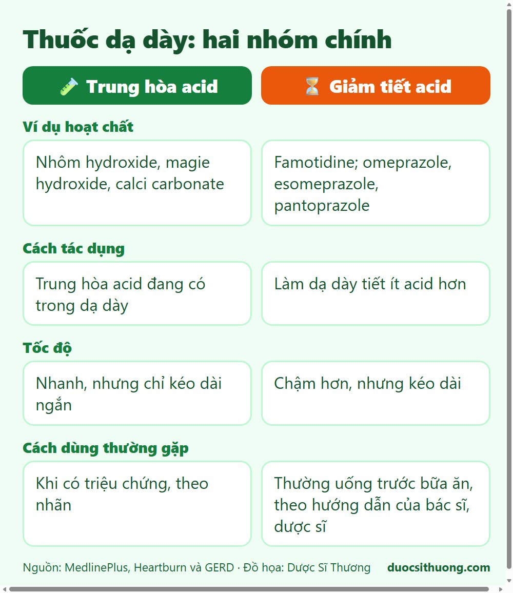
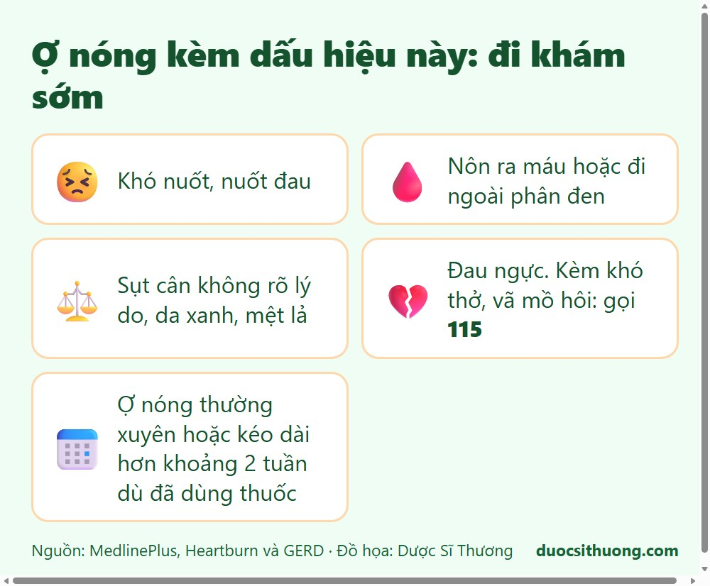

## Tóm tắt nhanh

Ợ nóng, ợ chua, đau vùng thượng vị là những triệu chứng rất hay gặp. Thuốc dạ dày thường gồm hai nhóm chính: **thuốc trung hòa acid** (dùng khi có triệu chứng) và **thuốc giảm tiết acid** (tác dụng chậm hơn nhưng kéo dài). Thuốc chỉ giúp giảm triệu chứng, còn nếu triệu chứng kéo dài hoặc có dấu hiệu cảnh báo thì cần đi khám, không nên tự điều trị lâu ngày.

## Hai nhóm thuốc thường gặp

*Đồ họa: Dược Sĩ Thương. Nguồn: MedlinePlus.*

| | Thuốc trung hòa acid | Thuốc giảm tiết acid |
| --- | --- | --- |
| Ví dụ hoạt chất | Nhôm hydroxide, magie hydroxide, calci carbonate | Nhóm ức chế thụ thể H2 (như famotidine); nhóm ức chế bơm proton (như omeprazole, esomeprazole, pantoprazole) |
| Cách tác dụng | Trung hòa acid đang có trong dạ dày | Làm dạ dày tiết ít acid hơn |
| Tốc độ | Nhanh, nhưng chỉ kéo dài trong thời gian ngắn | Chậm hơn, nhưng tác dụng kéo dài |
| Cách dùng thường gặp | Khi có triệu chứng, theo nhãn | Thường uống trước bữa ăn, theo hướng dẫn của bác sĩ, dược sĩ |

## Lưu ý khi dùng

- **Thuốc trung hòa acid** có thể làm giảm hấp thu một số thuốc khác. Hãy hỏi dược sĩ nên uống cách nhau bao lâu. Một số loại gây táo bón (chứa nhôm, calci) hoặc tiêu chảy (chứa magie). Người có bệnh thận cần thận trọng với thuốc chứa nhôm, magie.
- **Thuốc giảm tiết acid** nếu dùng kéo dài nên có bác sĩ theo dõi. Dùng lâu ngày có thể liên quan đến thiếu một số vi chất (như vitamin B12, magie) và một số nguy cơ khác. Không nên tự dùng liên tục nhiều tháng chỉ vì "quen thuốc".
- **Đừng dùng thuốc dạ dày để "che" tác dụng phụ** của thuốc kháng viêm rồi tiếp tục tự dùng. Hãy hỏi bác sĩ về cách dùng phù hợp.
- Trẻ nhỏ, phụ nữ mang thai, cho con bú: hỏi bác sĩ trước khi dùng.

## Thói quen giúp giảm triệu chứng

- Không ăn quá no, tránh nằm ngay sau khi ăn.
- Tránh những thức ăn, đồ uống làm bạn khó chịu (đồ chiên rán, cay, rượu, cà phê...).
- Bỏ thuốc lá, giảm cân nếu thừa cân.

## Khi nào cần đi khám?

*Đồ họa: Dược Sĩ Thương. Nguồn: MedlinePlus.*

Hãy đi khám sớm nếu có một trong các dấu hiệu sau:

- **Khó nuốt**, nuốt đau.
- **Nôn ra máu** hoặc **đi ngoài phân đen**.
- **Sụt cân không rõ lý do**, da xanh, mệt lả (có thể thiếu máu).
- **Đau ngực** (cần phân biệt với bệnh tim, đặc biệt nếu kèm khó thở, vã mồ hôi thì gọi **115**).
- Ợ nóng xảy ra thường xuyên hoặc kéo dài hơn khoảng 2 tuần dù đã dùng thuốc.

Thông tin trong bài chỉ mang tính tham khảo. Hãy hỏi bác sĩ, dược sĩ để chọn thuốc và thời gian dùng phù hợp với bạn.
