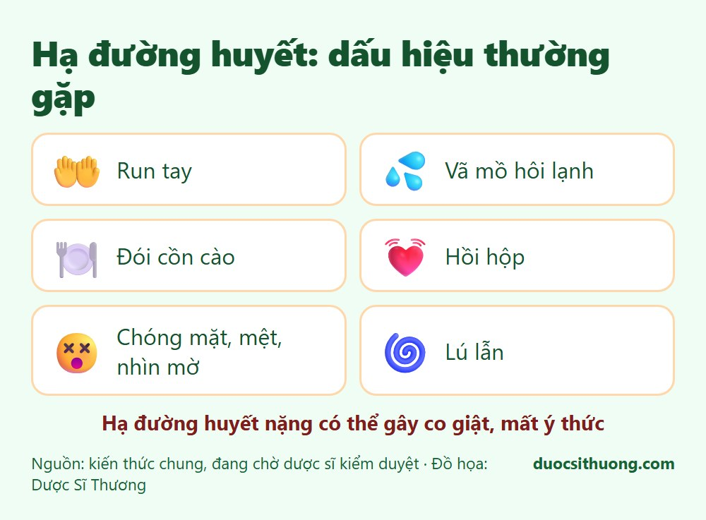
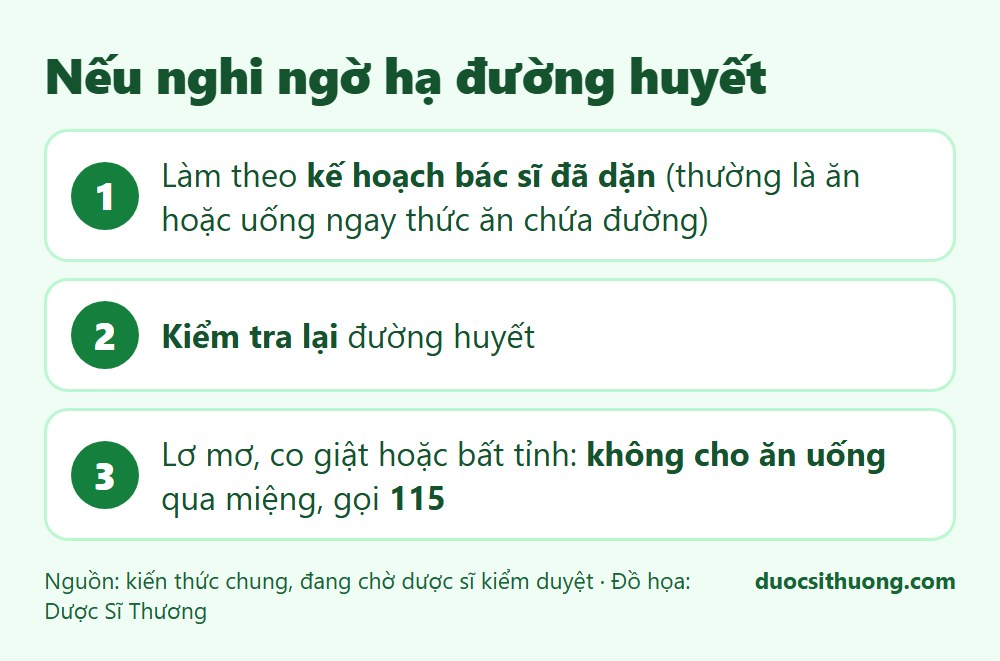

## Tóm tắt nhanh

Đái tháo đường được kiểm soát bằng **ăn uống, vận động** và, tùy từng người, **thuốc uống hoặc insulin**. Theo MedlinePlus, bạn **không nên tự thay đổi hoặc ngưng thuốc** mà chưa hỏi bác sĩ. Điều cần đề phòng hàng đầu khi dùng insulin và một số thuốc uống là **hạ đường huyết**. Hãy học cách nhận biết và trao đổi với bác sĩ về cách xử trí phù hợp với bạn.

## Các nhóm thuốc thường gặp

- **Thuốc uống** (ví dụ metformin và một số nhóm khác): giúp cơ thể sử dụng đường tốt hơn hoặc giảm lượng đường trong máu.
- **Insulin** (tiêm): cần thiết với đái tháo đường type 1, và một số người đái tháo đường type 2 cũng cần.

Loại thuốc, liều dùng do bác sĩ quyết định dựa trên tình trạng của từng người. Người bệnh cũng thường cần thêm thuốc kiểm soát huyết áp và mỡ máu.

## Hạ đường huyết: dấu hiệu và cách phòng

*Đồ họa: Dược Sĩ Thương. Nguồn: kiến thức chung, đang chờ dược sĩ kiểm duyệt.*

**Dấu hiệu thường gặp:** run tay, vã mồ hôi lạnh, đói cồn cào, hồi hộp, chóng mặt, mệt, nhìn mờ, lú lẫn. Hạ đường huyết nặng có thể gây co giật, mất ý thức.

**Cách phòng:**

- Ăn đúng bữa, **không bỏ bữa** sau khi đã tiêm insulin hoặc uống thuốc.
- Hoạt động thể lực nhiều hơn thường lệ có thể làm đường huyết hạ, hãy hỏi bác sĩ cách điều chỉnh.
- **Uống rượu**, nhất là khi đói, làm tăng nguy cơ hạ đường huyết.
- Đo đường huyết theo hướng dẫn của bác sĩ và ghi lại.
- Luôn có sẵn thức ăn hoặc đồ uống chứa đường hấp thu nhanh theo hướng dẫn của bác sĩ.

*Đồ họa: Dược Sĩ Thương. Nguồn: kiến thức chung, đang chờ dược sĩ kiểm duyệt.*

**Nếu nghi ngờ hạ đường huyết:** làm theo **kế hoạch mà bác sĩ đã dặn** (thường là ăn hoặc uống ngay thức ăn chứa đường rồi kiểm tra lại đường huyết). **Nếu người bệnh lơ mơ, không tỉnh táo hoặc co giật, không cho ăn uống gì qua miệng và gọi 115.**

## Những điều không nên tự làm

- **Tự ngưng thuốc**, giảm liều khi thấy đường huyết đã ổn, hoặc tăng liều khi đường huyết cao.
- **Tự dùng "thuốc hạ đường huyết" không rõ nguồn gốc** hay thực phẩm chức năng quảng cáo "hạ đường huyết nhanh": một số sản phẩm có thể có thuốc mà không ghi trên nhãn, gây hạ đường huyết nặng.
- **Ngưng thuốc khi ốm** (sốt, nôn, tiêu chảy, ăn kém): hãy hỏi bác sĩ cách điều chỉnh thuốc những ngày này.
- **Tự dùng chung thuốc, kim tiêm, bút tiêm** với người khác.

## Bảo quản insulin

Hãy đọc hướng dẫn của nhà sản xuất. Thông thường insulin chưa mở được giữ ở ngăn mát tủ lạnh (không để đông đá), còn bút đang dùng có thể để ở nhiệt độ phòng trong thời gian nhất định ghi trên nhãn. Không để dưới nắng hoặc trong xe nóng.

## Ăn uống và vận động vẫn quan trọng

Dù đang dùng thuốc, người bệnh vẫn cần ăn uống lành mạnh, vận động đều đặn, bỏ thuốc lá và duy trì cân nặng hợp lý. Thuốc chỉ là một phần của điều trị.

## Khi nào cần đi khám hoặc cấp cứu?

- **Gọi 115:** hạ đường huyết nặng (lơ mơ, co giật, bất tỉnh), hoặc khát nhiều, nôn, đau bụng, thở nhanh, li bì kèm đường huyết rất cao.
- **Đi khám sớm:** hạ đường huyết xảy ra nhiều lần, đường huyết luôn cao dù đã dùng thuốc, vết loét ở bàn chân, tê bì tay chân, nhìn mờ.

Thông tin trong bài chỉ mang tính tham khảo. Hãy tuân theo chỉ định của bác sĩ điều trị.
