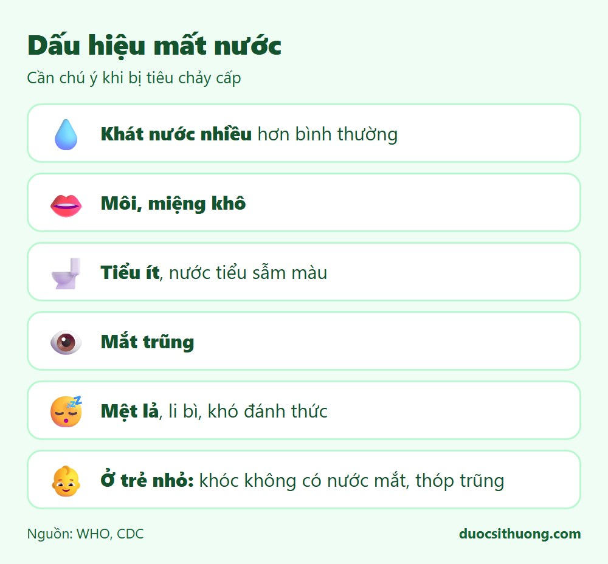
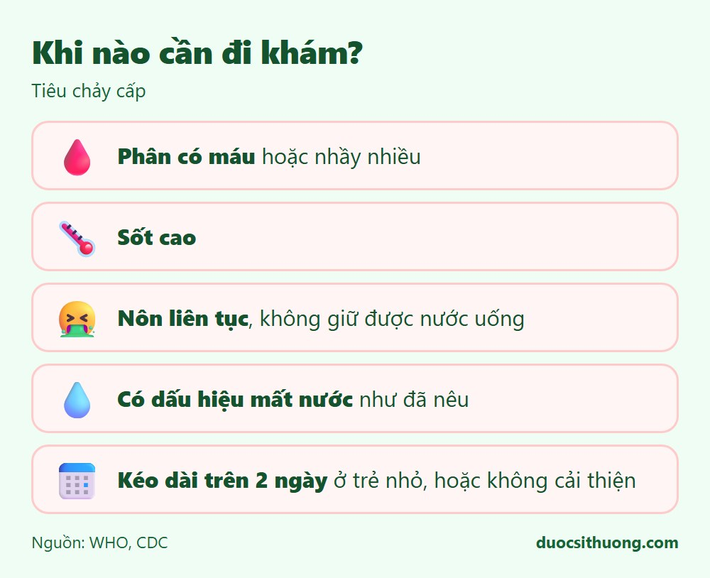

## Tóm tắt nhanh

Tiêu chảy cấp là đi ngoài phân lỏng hoặc nhiều nước từ 3 lần trở lên trong một ngày, thường do virus hoặc vi khuẩn và tự khỏi sau vài ngày. Việc quan trọng nhất là **bù đủ nước và muối** đã mất, đặc biệt ở trẻ nhỏ và người cao tuổi.

## Dấu hiệu mất nước cần chú ý

*Đồ họa: Dược Sĩ Thương. Nguồn: WHO, CDC.*

- Khát nước nhiều hơn bình thường.
- Môi, miệng khô.
- Đi tiểu ít, nước tiểu sẫm màu.
- Mắt trũng.
- Mệt lả, li bì hoặc khó đánh thức.
- **Ở trẻ nhỏ:** khóc không có nước mắt, thóp trũng (trẻ còn thóp), da véo lên chậm trở lại bình thường.

## Cách xử trí tại nhà

- **Uống oresol (dung dịch bù nước và điện giải)** pha đúng theo hướng dẫn trên gói, uống từng ngụm nhỏ. Đây là biện pháp quan trọng nhất theo khuyến cáo của WHO.
- Vẫn cho trẻ ăn, bú mẹ bình thường trong lúc bị tiêu chảy; không cần nhịn ăn.
- Người lớn nên ăn thức ăn dễ tiêu, uống đủ nước; tránh rượu bia, cà phê và đồ uống có nhiều đường.
- Kẽm dạng bổ sung có thể được bác sĩ chỉ định cho trẻ nhỏ bị tiêu chảy, theo khuyến cáo của WHO.
- Không tự ý dùng thuốc cầm tiêu chảy cho trẻ nhỏ khi chưa hỏi ý kiến bác sĩ, dược sĩ.

## Khi nào cần đi khám?

*Đồ họa: Dược Sĩ Thương. Nguồn: WHO, CDC.*

Hãy đi khám hoặc đưa trẻ đi khám ngay nếu:

- Phân có máu hoặc nhầy nhiều.
- Sốt cao.
- Nôn liên tục, không giữ được nước uống.
- Có dấu hiệu mất nước như đã nêu ở trên.
- Tiêu chảy kéo dài hơn 2 ngày ở trẻ nhỏ, hoặc không cải thiện sau vài ngày ở người lớn.
- Trẻ nhỏ dưới 3 tháng tuổi bị tiêu chảy.

Nếu người bệnh lơ mơ, không uống được, co giật hoặc có dấu hiệu mất nước nặng, hãy gọi **115** ngay.

## Phòng ngừa

- Rửa tay bằng xà phòng trước khi ăn và sau khi đi vệ sinh.
- Ăn chín, uống sôi; bảo quản thực phẩm đúng cách.
- Cho trẻ bú mẹ hoàn toàn trong 6 tháng đầu.
- Tiêm vắc xin Rota cho trẻ đúng lịch để phòng tiêu chảy do virus Rota.

Xem thêm: [5 nguyên tắc ăn uống lành mạnh](/an-uong/nguyen-tac-an-uong-lanh-manh/)
