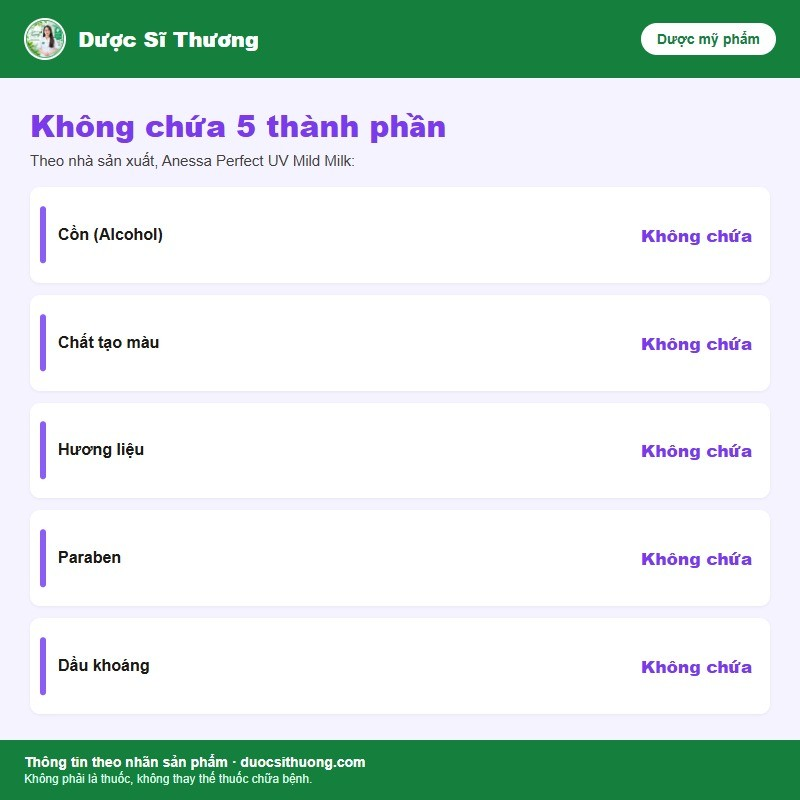
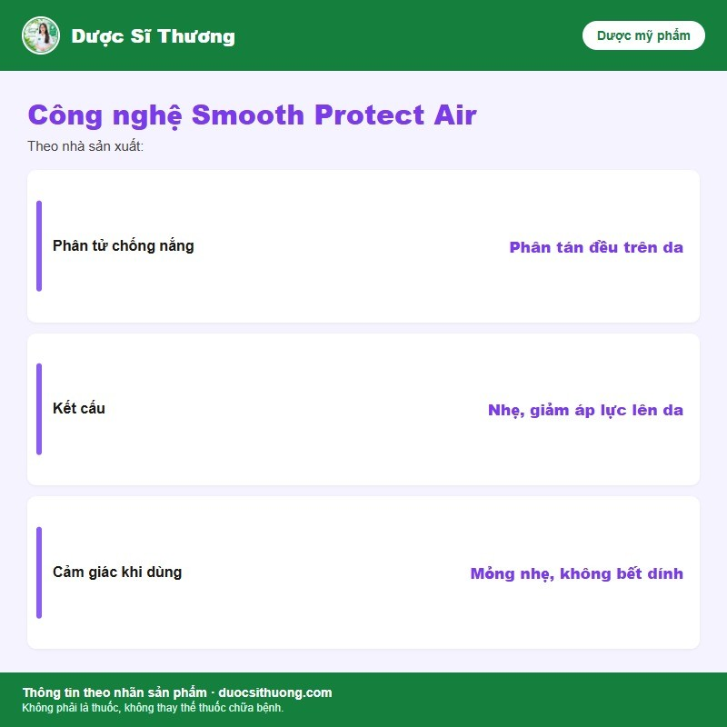

## Mô tả sản phẩm

**Anessa Perfect UV Sunscreen Mild Milk** là kem chống nắng dạng sữa của thương hiệu **Anessa** (Shiseido, Nhật Bản), chỉ số chống nắng SPF50+ PA++++, dành riêng cho da nhạy cảm. Theo nhà sản xuất, sản phẩm ứng dụng công nghệ Smooth Protect Air giúp phân tán đều lớp chống nắng, kết cấu nhẹ, giảm áp lực lên da.

*Nguồn: tư liệu nhà phân phối Anessa.*

**Mỹ phẩm, không phải là thuốc, không có tác dụng điều trị bệnh.**

## Công dụng

Theo nhà sản xuất, sản phẩm bảo vệ da khỏi tác hại của tia UV, phù hợp cho da nhạy cảm, trẻ em từ 6 tháng tuổi và da thiên dầu; dùng được cho cả mặt và cơ thể.

*Nguồn: tư liệu nhà phân phối Anessa.*

*Nguồn: tư liệu nhà phân phối Anessa.*

## Đối tượng sử dụng

Người có da nhạy cảm, da thiên dầu; trẻ em từ 6 tháng tuổi trở lên (theo công bố của nhà sản xuất).

## Cách dùng

Thoa đều lên mặt và cơ thể trước khi ra nắng. Thoa lại sau khi bơi, đổ mồ hôi nhiều hoặc lau khô da.

## Lưu ý

- Mỹ phẩm dùng ngoài da, chỉ dùng cho da mặt và cơ thể, tránh vùng mắt và niêm mạc.
- Ngừng sử dụng và hỏi ý kiến bác sĩ da liễu nếu da có dấu hiệu kích ứng (đỏ, ngứa, rát).
- Nên thử sản phẩm ở vùng da nhỏ trước khi dùng rộng, đặc biệt với trẻ nhỏ hoặc da nhạy cảm.
- Tránh để sản phẩm tiếp xúc với mắt; nếu dính vào mắt, rửa ngay bằng nước sạch.

## Bảo quản

Bảo quản nơi khô ráo, thoáng mát, tránh ánh nắng trực tiếp. Để xa tầm tay trẻ em.
