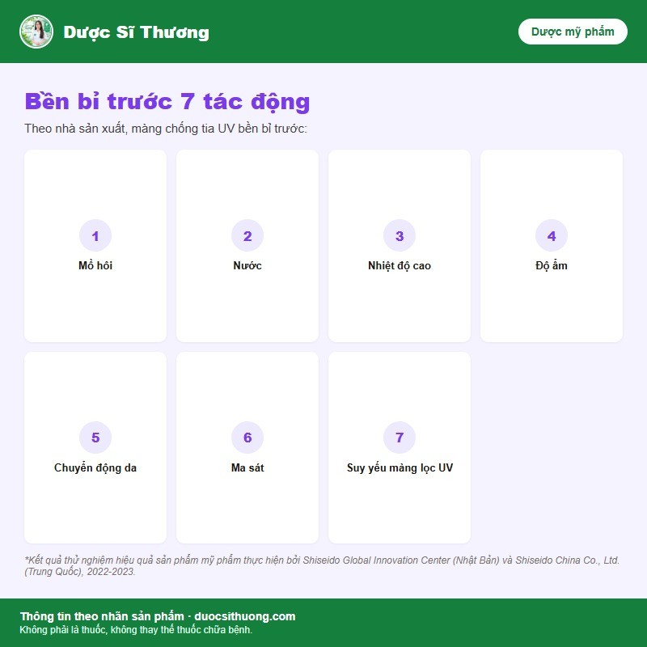

## Mô tả sản phẩm

**Anessa Perfect UV Sunscreen Skincare Milk Na** là kem chống nắng dạng sữa của thương hiệu **Anessa** (Shiseido, Nhật Bản), chỉ số chống nắng SPF50+ PA++++, dòng kiềm dầu. Theo nhà sản xuất, sản phẩm ứng dụng công nghệ Auto Veil và Auto Booster giúp màng chống nắng tự phục hồi khi gặp nước, mồ hôi, giúp duy trì hiệu quả chống nắng bền bỉ trong ngày.

*Nguồn: tư liệu nhà phân phối Anessa.*

**Mỹ phẩm, không phải là thuốc, không có tác dụng điều trị bệnh.**

## Công dụng

Theo nhà sản xuất, sản phẩm giúp chống nắng mạnh với kết cấu thoáng nhẹ, da ẩm mượt suốt 8 giờ, ráo nhanh không bết dính, kiềm dầu suốt 12 giờ (kết quả thử nghiệm với 27 phụ nữ tại Trung Quốc, theo công bố của nhà sản xuất). Công nghệ Auto Veil giúp tự động làm liền các vết đứt gãy của lớp màng chống tia UV; công nghệ Auto Booster giúp các phân tử liên kết thành lớp màng chống tia UV bền chặt hơn khi gặp nước, mồ hôi.

*Nguồn: tư liệu nhà phân phối Anessa.*

## Đối tượng sử dụng

Người có nhu cầu chống nắng kiềm dầu, dùng hằng ngày, khi hoạt động ngoài trời hoặc chơi thể thao.

## Cách dùng

Thoa đều lên mặt và cơ thể trước khi ra nắng. Thoa lại sau khi bơi, đổ mồ hôi nhiều hoặc lau khô da.

## Lưu ý

- Mỹ phẩm dùng ngoài da, chỉ dùng cho da mặt và cơ thể, tránh vùng mắt và niêm mạc.
- Ngừng sử dụng và hỏi ý kiến bác sĩ da liễu nếu da có dấu hiệu kích ứng (đỏ, ngứa, rát).
- Nên thử sản phẩm ở vùng da nhỏ trước khi dùng rộng, đặc biệt với da nhạy cảm.
- Tránh để sản phẩm tiếp xúc với mắt; nếu dính vào mắt, rửa ngay bằng nước sạch.

## Bảo quản

Bảo quản nơi khô ráo, thoáng mát, tránh ánh nắng trực tiếp. Để xa tầm tay trẻ em.
