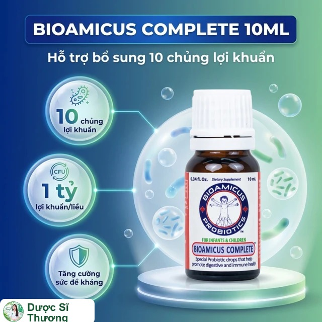
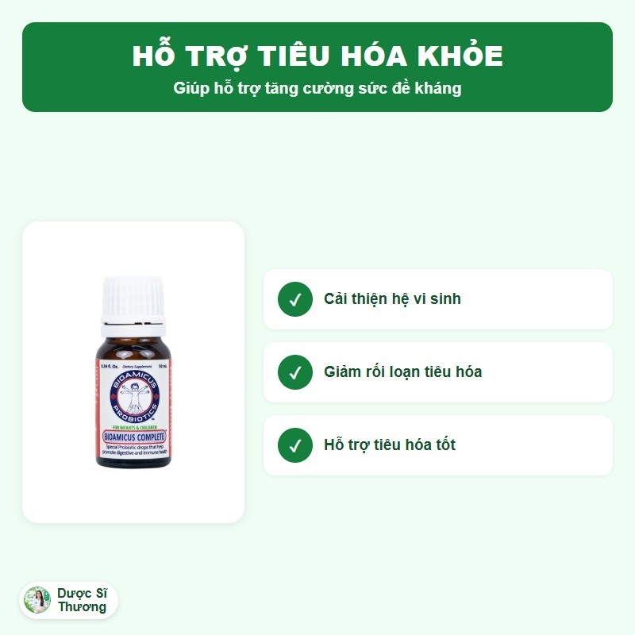

## Mô tả sản phẩm

**Bioamicus Complete** là thực phẩm bảo vệ sức khỏe dạng dung dịch nhỏ giọt của thương hiệu **BioAmicus** (Canada), bổ sung 10 chủng lợi khuẩn (5 chủng Lactobacillus và 5 chủng Bifidobacterium). Mỗi liều 5 giọt chứa 1 tỷ CFU lợi khuẩn (10 chủng x 100 triệu CFU/chủng). Sản xuất bởi BioAmicus Laboratories Inc. (Toronto, Canada); Công ty Cổ phần Kinh doanh và Phát triển Hòa Bình chịu trách nhiệm về chất lượng hàng hóa tại Việt Nam.

Theo nhà sản xuất, sản phẩm không chứa thành phần biến đổi gen, không chứa hương liệu, màu hay chất bảo quản thực phẩm, và không chứa các thành phần dễ gây dị ứng như protein sữa, lactose, các loại hạt, đậu phộng, ngô, đậu nành, gluten, lúa mì, trứng, cá, động vật có vỏ.

*Thiết kế lại từ tư liệu nhà phân phối. Đồ họa: Dược Sĩ Thương.*

*Thiết kế lại từ tư liệu nhà phân phối. Đồ họa: Dược Sĩ Thương.*

**Thực phẩm bảo vệ sức khỏe, không phải là thuốc, không có tác dụng thay thế thuốc chữa bệnh.**

## Công dụng

Theo nhà sản xuất, sản phẩm giúp bổ sung 10 chủng lợi khuẩn hỗ trợ cải thiện hệ vi sinh đường ruột; hỗ trợ giảm triệu chứng rối loạn tiêu hóa do loạn khuẩn đường ruột; hỗ trợ tăng cường sức đề kháng cho cơ thể.

*Thiết kế lại từ tư liệu nhà phân phối. Đồ họa: Dược Sĩ Thương.*

## Đối tượng sử dụng

Trẻ em có triệu chứng rối loạn tiêu hóa như tiêu chảy, phân sống, đầy bụng khó tiêu, táo bón; người đang hoặc mới dùng kháng sinh kéo dài gây loạn khuẩn đường ruột; người có nhu cầu bổ sung lợi khuẩn hỗ trợ tiêu hóa và sức đề kháng.

## Cách dùng

- **Trẻ dưới 1 tuổi:** dùng theo hướng dẫn của bác sĩ (khuyến cáo 5 giọt/lần, ngày 1 lần).
- **Trẻ từ 1-12 tuổi, thanh thiếu niên và người lớn:** 5 giọt/lần, ngày 2 lần.
- Nếu đang dùng kháng sinh, nên uống cách thời điểm dùng kháng sinh ít nhất 2-3 giờ.
- Lắc kỹ trước khi dùng. Không để đầu nhỏ giọt tiếp xúc trực tiếp với bất kỳ chất lỏng nào, kể cả nước bọt.

Liều dùng theo nhãn sản phẩm, có thể điều chỉnh theo hướng dẫn của bác sĩ hoặc dược sĩ.

## Lưu ý

- Không dùng nếu đang buồn nôn, sốt, tiêu chảy ra máu hoặc đau bụng dữ dội.
- Không dùng cho người có tình trạng suy giảm miễn dịch (ví dụ đang điều trị ung thư, dùng corticosteroid dài ngày) trừ khi có chỉ định của bác sĩ.
- Ngừng dùng và hỏi ý kiến bác sĩ nếu triệu chứng không cải thiện hoặc nặng hơn sau 2 ngày sử dụng.
- Trẻ sinh non hoặc có vấn đề sức khỏe khác nên hỏi ý kiến bác sĩ trước khi dùng.
- Thực phẩm này không phải là thuốc và không dùng thay thế thuốc chữa bệnh.
- Không dùng cho người mẫn cảm với bất kỳ thành phần nào của sản phẩm.

## Bảo quản

Để xa tầm tay trẻ em. Bảo quản ở nhiệt độ phòng; sau khi mở nắp, bảo quản lạnh ở nhiệt độ 2-8 độ C. Hạn dùng in trực tiếp trên bao bì sản phẩm (xem Mfg. Date/Exp. Date).
