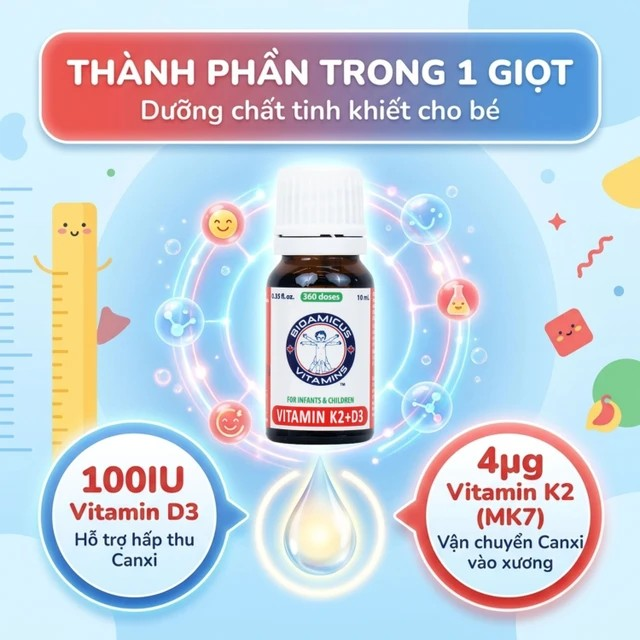
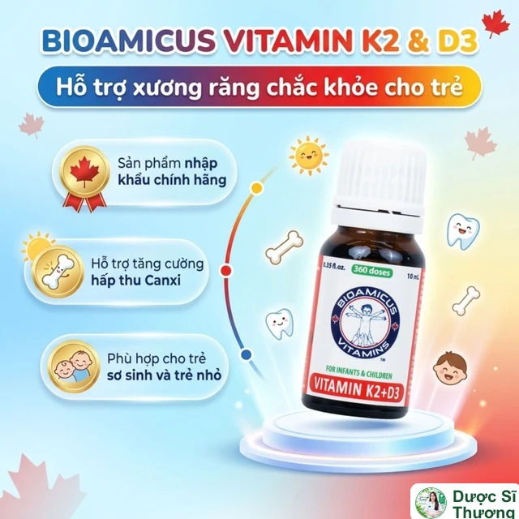
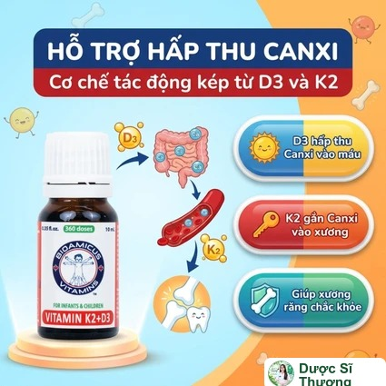
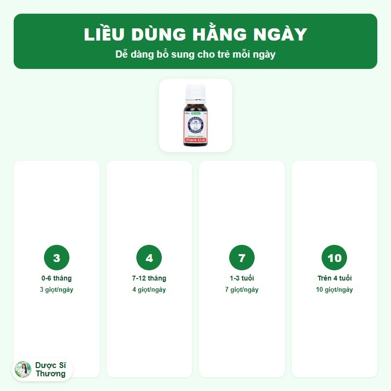

## Mô tả sản phẩm

**Bioamicus Vitamin K2 & D3** là thực phẩm bảo vệ sức khỏe dạng dung dịch nhỏ giọt của thương hiệu **BioAmicus** (Canada), bổ sung vitamin D3 và vitamin K2 (dạng MK-7). Mỗi giọt (0,028ml) chứa 100 IU vitamin D3 và 4µg vitamin K2. Sản xuất bởi BioAmicus Laboratories Inc. (Toronto, Canada); Công ty Cổ phần và Kinh doanh Phát triển Hòa Bình chịu trách nhiệm về chất lượng hàng hóa, nhập khẩu bởi Công ty TNHH Dược Hunmed.

Theo nhà sản xuất, sản phẩm không chứa thành phần biến đổi gen, không chứa hương liệu, màu hay chất bảo quản thực phẩm, và không chứa các thành phần dễ gây dị ứng như trứng, sữa, đậu nành, các loại hạt, đường, lúa mì, gluten, lạc, động vật có vỏ.

*Thiết kế lại từ tư liệu nhà phân phối. Đồ họa: Dược Sĩ Thương.*

*Thiết kế lại từ tư liệu nhà phân phối. Đồ họa: Dược Sĩ Thương.*

**Thực phẩm bảo vệ sức khỏe, không phải là thuốc, không có tác dụng thay thế thuốc chữa bệnh.**

## Công dụng

Theo nhà sản xuất, sản phẩm giúp bổ sung vitamin D3 và K2 cho cơ thể, hỗ trợ tăng cường hấp thu canxi, hỗ trợ tốt cho sức khỏe xương và răng ở trẻ em.

*Thiết kế lại từ tư liệu nhà phân phối. Đồ họa: Dược Sĩ Thương.*

## Đối tượng sử dụng

Trẻ còi xương, trẻ trong giai đoạn phát triển, trẻ ít tiếp xúc với ánh nắng mặt trời, trẻ có chế độ ăn thiếu vitamin D và K2.

## Cách dùng

| Độ tuổi | Liều dùng hằng ngày |
| --- | --- |
| 0-6 tháng | 3 giọt/ngày |
| 7-12 tháng | 4 giọt/ngày |
| 1-3 tuổi | 7 giọt/ngày |
| Trên 4 tuổi | 10 giọt/ngày |

*Thiết kế lại từ tư liệu nhà phân phối. Đồ họa: Dược Sĩ Thương.*

Có thể thêm vào thức ăn, thức uống hoặc uống trực tiếp. Không để đầu nhỏ giọt tiếp xúc trực tiếp với miệng. Lắc kỹ trước khi dùng.

Liều dùng theo nhãn sản phẩm, có thể điều chỉnh theo hướng dẫn của bác sĩ hoặc dược sĩ.

## Lưu ý

- Thực phẩm này không phải là thuốc và không dùng thay thế thuốc chữa bệnh.
- Không dùng cho người mẫn cảm với bất kỳ thành phần nào của sản phẩm.
- Nên hỏi ý kiến bác sĩ hoặc dược sĩ trước khi dùng nếu trẻ đang dùng thuốc chống đông máu hoặc có bất kỳ bệnh lý nào khác.

## Bảo quản

Để xa tầm tay trẻ em. Bảo quản ở nhiệt độ khoảng 4-25 độ C. Hạn dùng in trực tiếp trên bao bì sản phẩm (xem Mfg. Date/Exp. Date).
