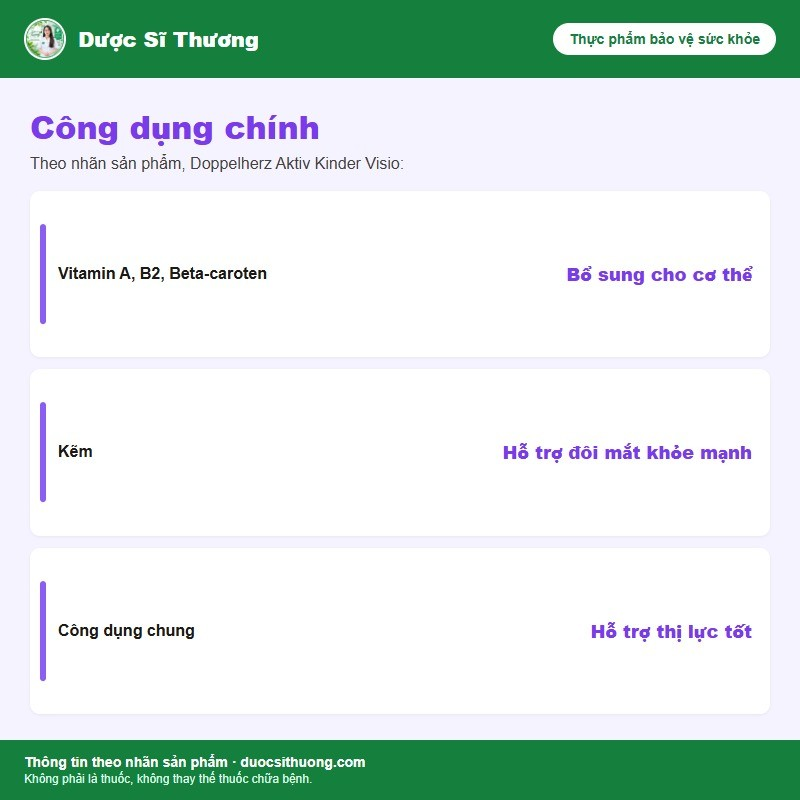

## Mô tả sản phẩm

**Doppelherz Aktiv Kinder Visio** là thực phẩm bảo vệ sức khỏe dạng viên nhai của thương hiệu **Doppelherz** (Đức), bổ sung Lutein, Beta-caroten, kẽm cùng các vitamin A, B2, E cho mắt. Sản xuất bởi Queisser Pharma GmbH & Co. KG (Flensburg, Đức); Công ty Cổ phần Mastertran chịu trách nhiệm về sản phẩm, nhập khẩu và phân phối tại Việt Nam.

*Nguồn: nhãn sản phẩm Doppelherz Aktiv Kinder Visio.*

**Thực phẩm bảo vệ sức khỏe, không phải là thuốc, không có tác dụng thay thế thuốc chữa bệnh.**

## Công dụng

Theo nhãn sản phẩm, Kinder Visio bổ sung vitamin A, B2, Beta-caroten; kẽm hỗ trợ đôi mắt khỏe mạnh và hỗ trợ thị lực tốt.

## Đối tượng sử dụng

Trẻ từ 4 tuổi trở lên.

## Cách dùng

Sử dụng hằng ngày, nhai kỹ viên khi dùng.

| Độ tuổi | Liều dùng hằng ngày |
| --- | --- |
| Trẻ em 4-7 tuổi | 1 viên/ngày |
| Trẻ em 8-16 tuổi | 2 viên/ngày |

Không dùng để thay thế cho một chế độ ăn uống đa dạng. Không dùng quá liều khuyến cáo. Liều dùng theo nhãn sản phẩm, có thể điều chỉnh theo hướng dẫn của bác sĩ hoặc dược sĩ.

## Lưu ý

- Thực phẩm này không phải là thuốc và không dùng thay thế thuốc chữa bệnh.
- Không dùng cho người mẫn cảm với bất kỳ thành phần nào của sản phẩm.
- Trẻ dưới 4 tuổi, phụ nữ có thai hoặc đang cho con bú nên hỏi ý kiến bác sĩ/dược sĩ trước khi dùng.

## Bảo quản

Bảo quản nơi khô ráo, thoáng mát, dưới 25 độ C. Để xa tầm tay trẻ em.
