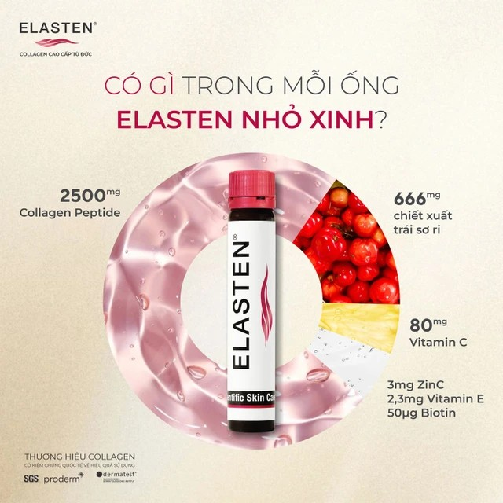
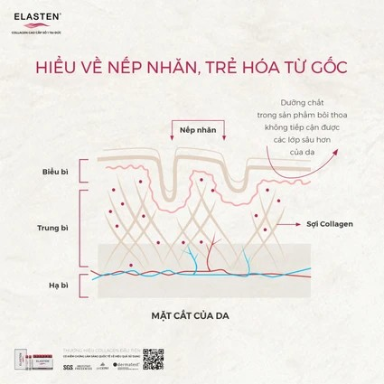

## Mô tả sản phẩm

**Elasten** là thực phẩm bảo vệ sức khỏe dạng nước uống đóng ống của thương hiệu **Elasten** (Đức), bổ sung collagen peptide cùng vitamin C, kẽm, vitamin E và biotin. Mỗi ống 25ml chứa 2,5g Collagen Peptide. Sản xuất bởi Sanomed Gesundheits- und Sport-nahrungsmittelherstellung GmbH (Vöhringen, Đức); Công ty TNHH Elasten Việt Nam nhập khẩu và phân phối tại Việt Nam.

*Nguồn: tư liệu nhà phân phối Elasten.*

**Thực phẩm bảo vệ sức khỏe, không phải là thuốc, không có tác dụng thay thế thuốc chữa bệnh.**

## Công dụng

Theo nhà sản xuất, sản phẩm bổ sung Collagen-Peptide, vitamin C và kẽm, hỗ trợ làm giảm lão hóa da, giúp tăng độ đàn hồi và giữ độ ẩm cho da, giúp da sáng mịn.

*Nguồn: tư liệu nhà phân phối Elasten.*

## Đối tượng sử dụng

Người trưởng thành bị lão hóa da, người có nhu cầu chăm sóc và làm đẹp da.

## Cách dùng

Uống 1 ống mỗi ngày lúc bụng đói.

Liều dùng theo nhãn sản phẩm, có thể điều chỉnh theo hướng dẫn của bác sĩ hoặc dược sĩ.

## Lưu ý

- Không dùng vượt quá lượng khuyến cáo dùng hằng ngày.
- Thực phẩm chức năng này không thay thế chế độ ăn uống đa dạng, cân bằng và lối sống lành mạnh.
- Có chứa fructose.
- Không dùng cho người mẫn cảm với bất kỳ thành phần nào của sản phẩm.
- Thực phẩm này không phải là thuốc và không dùng thay thế thuốc chữa bệnh.
- Phụ nữ có thai, đang cho con bú, người có bệnh nền nên hỏi ý kiến bác sĩ/dược sĩ trước khi dùng.

## Bảo quản

Bảo quản nơi khô ráo, tránh ánh nắng trực tiếp. Để xa tầm tay trẻ em. Hạn dùng 30 tháng kể từ ngày sản xuất, xem hạn sử dụng in trên bao bì sản phẩm.
