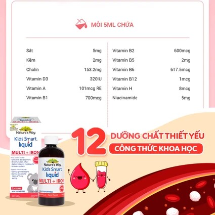

## Mô tả sản phẩm

**Kids Smart Liquid Multi + Iron** là thực phẩm bảo vệ sức khỏe dạng siro của thương hiệu **Nature's Way** (Úc), bổ sung sắt cùng các vitamin và khoáng chất cần thiết cho trẻ em. Mỗi 5ml chứa 5mg sắt cùng choline, kẽm và các vitamin A, nhóm B, D3. Sản xuất bởi Probiotec Pharma Pty Ltd., phân phối tại Úc bởi PharmaCare Laboratories Pty Ltd.; Công ty Cổ phần Master Bee nhập khẩu, Công ty Cổ phần Xuất nhập khẩu Việt Liên Kết phân phối và chịu trách nhiệm về chất lượng sản phẩm tại Việt Nam.

*Nguồn: tư liệu nhà phân phối Nature's Way.*

**Thực phẩm bảo vệ sức khỏe, không phải là thuốc, không có tác dụng thay thế thuốc chữa bệnh.**

## Công dụng

Theo nhà sản xuất, sản phẩm hỗ trợ tăng cường sức khỏe, nâng cao sức đề kháng cho trẻ.

## Đối tượng sử dụng

Trẻ em từ 1 tuổi trở lên.

## Cách dùng

| Độ tuổi | Liều dùng hằng ngày |
| --- | --- |
| Trẻ em 1-5 tuổi | 5ml/ngày |
| Trẻ em 6-11 tuổi | 10ml/ngày |

Liều dùng theo nhãn sản phẩm, có thể điều chỉnh theo hướng dẫn của bác sĩ hoặc dược sĩ.

## Lưu ý

- Không dùng để điều trị các tình trạng thiếu sắt. Vitamin và khoáng chất chỉ có thể hỗ trợ khi chế độ ăn uống không đáp ứng đủ nhu cầu.
- Không dùng cho người mẫn cảm với bất kỳ thành phần nào của sản phẩm.
- Thực phẩm này không phải là thuốc và không dùng thay thế thuốc chữa bệnh.
- Phụ nữ mang thai, đang dùng thuốc nên hỏi ý kiến bác sĩ trước khi dùng.

## Bảo quản

Bảo quản dưới 25 độ C. Bảo quản lạnh sau khi mở nắp và bỏ đi sau 60 ngày. Hạn dùng 24 tháng trước hạn sử dụng, xem hạn sử dụng in trên bao bì sản phẩm. Để xa tầm tay trẻ em.
